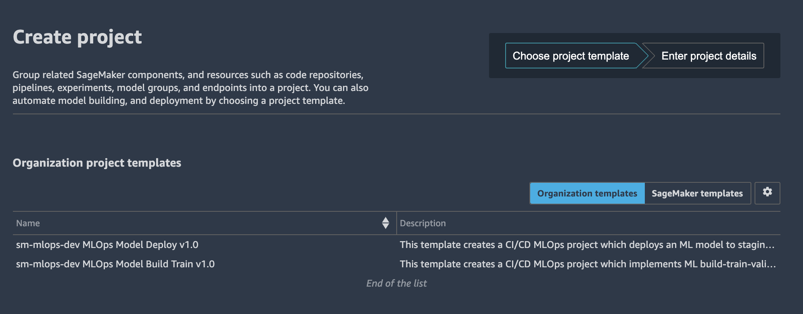
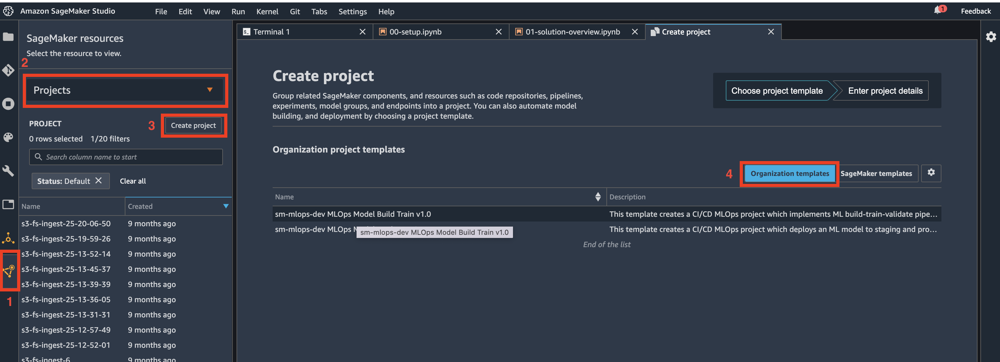
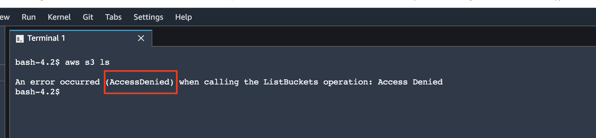
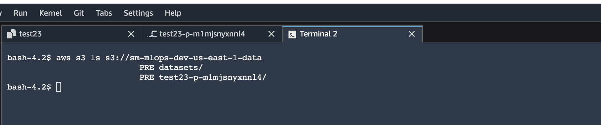
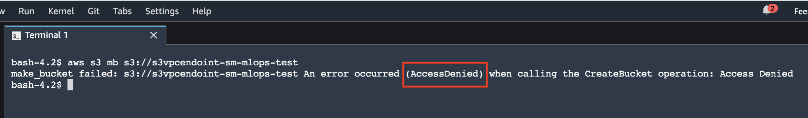
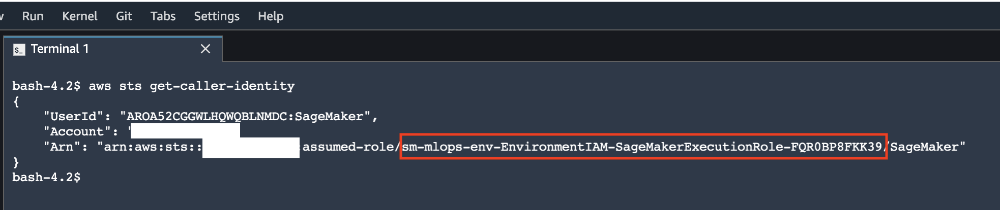

# Amazon SageMaker secure MLOps
The goal of the solution is to demonstrate a deployment of Amazon SageMaker Studio into a secure controlled environment and implementation of secure MLOps CI/CD pipelines.

We are going to cover the following four main topics in this solution:
1. Secure deployment of [Amazon SageMaker Studio](https://aws.amazon.com/sagemaker/studio/) into a new or an existing secure environment (VPC, private subnets, VPC endpoints, security groups). We implement end-to-end data encryption and access control, audit/monitoring, and preventive, detective and responsive security controls
2. Self-service data science environment provisioning based on [AWS Service Catalog](https://aws.amazon.com/servicecatalog/?aws-service-catalog.sort-by=item.additionalFields.createdDate&aws-service-catalog.sort-order=desc) and [AWS CloudFormation](https://aws.amazon.com/cloudformation/)
3. Self-service [rovisioning of [MLOps project templates](https://docs.aws.amazon.com/sagemaker/latest/dg/sagemaker-projects-templates.html) in SageMaker Studio
4. MLOps CI/CD automation using [SageMaker projects](https://docs.aws.amazon.com/sagemaker/latest/dg/sagemaker-projects-whatis.html) and [SageMaker pipelines](https://docs.aws.amazon.com/sagemaker/latest/dg/pipelines.html) for model training and multi-account deployment

The solution recommends and implements the following development approach:
+ A separate AWS account per Data Science team and one Amazon SageMaker Studion domain per region per account
+ A separate AWS accounts for staging and production of AI/ML models
+ Usage of AWS Organizations to enable trust and security control policies for member AWS accounts

[Jump to solution deployment](README.md#Deployment)

# Amazon SageMaker features


# MLOps
The goals of implementing MLOps for your Amazon SageMaker project are:
+ Operationalization of AI/ML workloads and workflowsxs
+ Create secured, automated, and reproducible ML workflows
+ Manage models with a model registry
+ Enable continious delivery with IaC and CI/CD pipelines
+ Monitor performance and feedback information to your models


## Model registry
One of the key components of MLOps pipeline in Amazon SageMaker is the [model registry](https://docs.aws.amazon.com/sagemaker/latest/dg/model-registry.html).


The model registry provides the follwing features:
+ Centralized model storage and tracking service that stores lineage, versioning, and related metadata for ML models
+ Stores governance and audit data (e.g. who trained and published the model, which datasets were used)
+ Stores models metrics ad when the model was deployed to production
+ Manages model versions
+ Manages the approval status of a model

# Solution architecture
This section describes the overall solution architecture.

## AWS account, team, and project setup
The following diagram shows the proposed team and AWS account structure for the solution:


The SageMaker environment has a three-level organisational structure: Enterprise, Team (Environment), and Project.

+ **Enterprise** level: The highest level in hierarchy, represented by the `DS Administrator` role and _Data Science portfolio_ in AWS Service Catalog. A data science environment per team is provisioned via the AWS Service Catalog self-service into a dedicated AWS Account.
+ **Team/Environment** level: There is one dedicated Data Science Team AWS account and one SageMaker Studio domain per region per AWS account. DS Team Administrator can create user profiles in SageMaker studio for different user roles with different permissions, and also provision a CI/CD MLOps pipeline per project. The DS Administrator role is responsible for approving ML models and deployment into staging and production accounts. Based on role permission setup you can implement fine-granular separation of rights and duties per project. You can find more details on permission control with IAM policies and resource tagging in the blog post [Configuring Amazon SageMaker Studio for teams and groups with complete resource isolation](https://aws.amazon.com/fr/blogs/machine-learning/configuring-amazon-sagemaker-studio-for-teams-and-groups-with-complete-resource-isolation/) on [AWS Machine Learning Blog](https://aws.amazon.com/blogs/machine-learning/)
+ **Project** level: This is the individual project level and represented by CI/CD pipelines which are provisioned via SageMaker projects in SageMaker studio

## Why multi-account
The best practice for implementing production and real-life data science environment is to use multiple AWS accounts. The multi-account approaches has the following benefits:
- Supports multiple unrelated teams
- Ensures fine-grained security and compliance controls
- Minimizes the blast radius
- Provides workload and data isolation
- Facilitates the billing and improves cost visibility and control
- Separates between development, test, and production 

## User setup
Initial baselines for the IAM roles are taken from [Secure data science reference architecture](https://github.com/aws-samples/secure-data-science-reference-architecture). You can edit role permissions policy based on your specific security guidelines and requirements.

This solution uses the concept of following roles in Model Development Life Cycle (MDLC):  
+  **Data engineer**/**ML Engineer**:
  Responsible for:
    - data sourcing
    - data quality assurance
    - data pre-processing
    - Feature engineering
    - develop data delivery pipelines (from the data source to destination S3 bucket where it is consumed by ML model/Data scientist)

    Permission baseline:
    - Data processing services (DMS, AWS Glue ETL, Athena, Kinesis, EMR, DataBrew, SageMaker, SageMaker Data Wrangler)
    - Data locations (S3, Data Lakes, Lake Formation)
    - Databases (RDS, Aurora, Redshift)
    - BI services (Grafana, Quicksight)
    - SageMaker notebooks

  ❗ This role is out of scope of this solution

+ **Data scientist**:  
  “Project user” role for a DataScientist. This solution implements a wide baseline permissions.You might trim the permissions down for your real-life projects to reflect your security environment and requirements. The provisioned role uses the AWS managed permission policy for the job function `DataScientist`:  
    - Model training and evaluation in SageMaker, SageMaker Studio, Notebooks, SageMaker JumpStart
    - Feature engineering
    - Starting ML pipelines
    - Deploy models to the model registry
    - GitLab permissions

    Permission baseline:
    - AWS managed policy `DataScientist`
    - Data locations (S3): only a defined set of S3 buckets (e.g. Data and Model)
    - SageMaker, SageMaker Studio, Notebooks

    Role definition: [JSON](iam/json/DataScientistRole.json), [CloudFormation](cfn_templates/iam-project-roles.yaml)

+ **Data science team administrator**:  
   This is the admin role for a team or data science environment. In real-life setup you might want to add one more level of hiearchy and add an administrator role per project (or group of projects) – it creates a separation of duties between proejcts and minimize the blast radius. In this solution we are going to have one administrator role per team or "environment" (effectively meaning that Project Adminstrator = Team Administrator). The main responsibilities of the role are:  
    - ML infrastructure management and operations (endpoints, monitoring, scaling, reliability/high availability, BCM/DR)
    - Model hosting
    - Production integration
    - Model approval for deployment in staging and production
    - Project template (MLOps) provisioning
    - Provision products via AWS Service Catalog
    - GitLab repository access

    Permission baseline:
    - PROD account
    - ML infrastructure
    - Data locations (S3)

    Role definition: [JSON](iam/json/DataScienceTeamAdministratorRole.json), [CloudFormation](cfn_templates/iam-project-roles.yaml)

+ **Data science administrator**:  
  This is overarching admin role for the data science projects and setting up the secure SageMaker environment. It uses only AWS managed policies. This role has the following responsibilities:
    - Shared Data Science infructure
    - Model approval for production
    - Deploys data science environments via the AWS Service Catalog

    Permission baseline:
    - Approvals (MLOps, Model registry, CodePipeline)
    - Permissions to deploy products from AWS Service Catalog  

    Role definition: [JSON](iam/json/DataScienceAdministratorRole.json), [CloudFormation](cfn_templates/iam-shared-roles.yaml)

A dedicated IAM role is created for each persona/user. For a real-life project we recommend to start with a least possible permission set and add necessary permissions when needed based on your security requirements and data science environment settings. 

## IAM setup
The following diagram shows the provisioned IAM roles for personas/users and execution roles for services:


More information and examples about the best practices and security setup for multi-project and multi-team environments you can find in the blog post [Configuring Amazon SageMaker Studio for teams and groups with complete resource isolation](https://aws.amazon.com/fr/blogs/machine-learning/configuring-amazon-sagemaker-studio-for-teams-and-groups-with-complete-resource-isolation/) on [AWS Machine Learning Blog](https://aws.amazon.com/blogs/machine-learning/).

### Multi-account setup for IAM roles
For this sample solution we use three AWS accounts to simulate development, staging, and production environments.The following describes how the IAM roles should be mapped to the accounts:  

#### IAM role to account mapping
**DEV account**:
  + All three IAM user roles must be created in the development (data science) account: `DataScienceAdministratorRole`, `DataScienceProjectAdministratorRole`, `DataScientistRole`

  - **DataScienceAdministratorRole**: overall management of Data Science projects via AWS Service Catalog. Management of the AWS Service Catalog. Deployment of a Data Science environment (VPC, subnets, S3 bucket) to an AWS account
  - **DataScientistRole**: Data Scientist role within a specific project. Provisioned on per-project and per-stage (dev/test/prod) basis
  - **DataScienceTeamAdministratorRole**: Administrator role within a specific team or environment
 
**TEST and PROD accounts**:
  + Only `DataScienceProjectAdministratorRole` must be created on these accounts. This role is responsible to approve the ML model deployment.

### IAM execution roles
The following IAM execution roles will be provisioned in the development account:
  + `SageMakerDetectiveControlExecutionRole`: for Lambda function to implement responsive/detective security controls
  + `SCLaunchRole`: for AWS Service Catalog to deploy the whole SageMaker environment
  + `SageMakerExecutionRole`: execution role for the SageMaker workloads and Studio
  + `SageMakerPipelineExecutionRole`: execution role for SageMaker pipelines
  + `SageMakerModelExecutionRole`: execution role for SageMaker model endpoint, will be created in each of dev, stating and production accounts
  + `SCProjectLaunchRole`: for AWS Service Catalog to deploy project-specific products (such as SageMaker Notebooks)
  + `AmazonSageMakerServiceCatalogProductsUseRole`: for SageMaker CI/CD execution (CodeBuild and CodePipeline)
  + `AmazonSageMakerServiceCatalogProductsLaunchRole`: for SageMaker MLOps project templates deployments
  + `VPCFlowLogsRole`: optional role for VPC Flow Logs to write logs into a CloudWatch log group

## AWS Organizations setup for multi-account ML model deployment
This solution uses a multi-account AWS environment setup in [AWS Organizations](https://aws.amazon.com/organizations/). OUs should be based on function or common set of controls rather than mirroring company’s reporting structure.

### OU setup for multi-account deployment
The implemented ML model multi-account deployment project assumes a specific OU setup pattern:
```
Root
`--- OU SageMaker PoC
      |--- Data Science account (development)
      `----OU Staging
            |--- Staging acccount
      `----OU Production
            |--- Production account
```

## SageMaker secure deployment in VPC 
The following deployment architecture is implemented by this solution:


The main design principles and decisions are:
+ Amazon SageMaker Studio domain is deployed in a dedicated VPC. Each [elastic network interface (ENI)](https://docs.aws.amazon.com/AWSEC2/latest/UserGuide/using-eni.html) used by SageMaker domain is created within a private dedicated subnet and attached to the specified security groups
+ `Data Science Team VPC` can be configured with internet access by attaching a **NAT gateway**. You can also run this VPC in internet-free mode without any inbound or outbound internet access
+ All access to S3 is routed via S3 VPC endpoints
+ All access to SageMaker API and runtime as welle as to AWS public services is routed via VPC endpoints
+ A PyPI repository mirror running on Fargate is hosted within your network to provide a python package repository in internet-free mode
+ AWS Service Catalog is used to deploy SageMaker project templates and Notebooks
+ All user roles are deployed into Data Science account IAM

## AWS Service Catalog approach
All self-provisoned products in this solution such as Data Science environment, SageMaker Studio user profile, SageMaker Notebooks, and MLOps project templates are delivered and deployed via [AWS Service Catalog](https://aws.amazon.com/servicecatalog).

One of the main advantages of using AWS Service Catalog for self-service provisioning is that users can configure and deploy configured products and AWS resources without needing full privileges to AWS services. The deployment of all AWS Service Catalog products happens under a specified service role with the defined set of permissions.

The Service Catalog approach offers the following features:

+ Products defined via CloudFormation templates
+ Create and share immutable best-practice templates
+ Control access to underlying AWS services
+ Self-service access for all end users
+ Implement technology recommendations and patterns
+ Provide security and information privacy guardrails

**Governed and secure environments** are delivered via AWS Service Data catalog:
+ Research and train ML models
+ Share reproducible results
+ Develop data processing automation
+ Develop ML model training automation
+ Define ML Deployment resources
+ Test assets before publishing


## AWS Service Catalog products in this solution
The following sections describe products which are delivered as part of this solution.

### Data science environment product
This product provisions end-to-end data science environment (Amazon SageMaker Studio) for a specific Data Science team (SageMaker Studio Domain) and stage (dev/test/prod). It deploys the following team- and stage-specific resources:
  + VPC:
    - Dedicated `Data Science Team VPC`
    - Private subnets in each of the selected Availability Zones (AZ), up to four AZs are supported
    - If NAT gateway option is selected: NAT gateways and public subnets in each of the selected AZs 
  + VPC endpoints:
    - S3 VPC endpoint (`gateway` type) and endpoint policy to access the S3 data and model buckets. Only data and model buckets can be accessed
    - VPC endpoints (`interface` type) to access AWS public services (CloudWatch, SSM, SageMaker, CodeCommit)
    - VPC endpoint to access the `Shared services VPC`
  + Security Groups:
    - SageMaker security group for SageMaker resources. No ingress allowed
    - VPC endpoint security group for all VPC endpoints. **HTTPS 443 ingress only**
    - VPC endpoint security group to access the `Shared services VPC`. **HTTP 80 ingress only**
  + IAM roles:
    - Data Scientist IAM role
    - Data Science team administrator IAM role
  + AWS KMS:
    - KMS key for data encryption in S3 buckets
    - KMS key for data encryption on EBS volumes attached to SageMaker instances (for training, processing, batch jobs)
  + S3 buckets:
    - Amazon S3 data bucket with bucket policy. The S3 bucket is encrypted with AWS KMS key.
    - Amazon S3 model bucket with bucket policy. The S3 bucket is encrypted with AWS KMS key

### Team-level products

#### SageMaker MLOps project templates
This solution deploys two [SageMaker projects](https://docs.aws.amazon.com/sagemaker/latest/dg/sagemaker-projects-whatis.html) as Service Catalog products:
+ Multi-account model deployment
+ Model building, training, and validating with SageMaker pipelines

These products are available as SageMaker projects in SageMaker Studio and only deployable from the Studio.



#### User profile for SageMaker Studio domain (_not implemented in this version_)
Each provisioning of a Data Science environment product creates a SageMaker Studio domain with a _default user profile_. You can optionally manually (from AWS CLI or SageMaker console) create new user profiles:

+ Each user profile has its own dedicated compute resource with a slice of the shared EFS file system
+ Each user profile can be associated with its own Execution Role (or use Domain role) (TBD for this solution)

❗ There is a limit of one SageMaker domain per region per account and you can provision only one Data Science environment product per region per account.

#### SageMaker notebook product (_not implemented in this version_)
This product is available for Data Scientist and Data Science Team Administrator roles. Each notebook is provisioned with pre-defined lifecycle configuration. The following considerations are applied to the notebook product:
+ Only some instance types are allowed to use in the notebook
+ Pre-defined notebook execution role is attached to the notebook
+ Notebook execution role enforce use of security configurations and controls (e.g. the notebook can be started only in VPC attachment mode)
+ Notebook has write access only to the projejct-specific S3 buckets (data and model as deployed by the Data Science Environment product)
+ Notebook-attached EBS volume is encrypted with its own AWS KMS key
+ Notebook is started in the SageMaker VPC, subnet, and security group

## MLOps pipelines
Functional MLOps architecture based on [SageMaker MLOps Project templates](https://docs.aws.amazon.com/sagemaker/latest/dg/sagemaker-projects-templates.html) as described in [Building, automating, managing, and scaling ML workflows using Amazon SageMaker Pipelines](https://aws.amazon.com/blogs/machine-learning/building-automating-managing-and-scaling-ml-workflows-using-amazon-sagemaker-pipelines/) and [Multi-account model deployment with Amazon SageMaker Pipelines](https://aws.amazon.com/blogs/machine-learning/multi-account-model-deployment-with-amazon-sagemaker-pipelines/) blog posts on the [AWS Machine Learning Blog](https://aws.amazon.com/blogs/machine-learning/).  

The following diagram shows the MLOps architecture which is implemented by this solution and delivered as MLOps SageMaker project templates:


The main design principles are:
+ MLOps project templates are deployed via SageMaker Studio
+ Dedicated IAM user and execution roles used to perform assigned actions/tasks in the environment
+ All project artefacts are connected via SageMaker ProjectId ensuring a strong data governance and lineage

The solution delivers two MLOps project templates:
+ Model build, train, validate
+ Model multi-account deploy

See more details in the [MLOps](README.md#MLOps) section.

## Security
This section describes security controls and best practices implemented by the solution.

### Compute and network isolation
+ Can all traffic be transferred over private and secure network links?
+ Can we block ingress and egress Internet access?
+ What is the tenancy model and are segregated user-spaces available?

### Authentication
+ Is all access compliant with our corporate authentication standards?
+ Can all user interfaces integrate with our Active Directory?

### Autorization
+ How do we authorize access to all resources?
+ Can we limit access to data, code and training resources by role and job function?

### Data protection
+ Can we encrypt all data in-transit and at-rest?
+ Does the service support encryption with Amazon KMS customer managed keys (CMK)?

### Artifact management
+ How do we safely bring in public and private libraries and frameworks?
+ How do we securely persist and protect code and model artifacts?

### Auditability
+ Does the service provide end-to-end auditability?
+ Can audit trails be captured at user and file/object level?

### Security controls

#### Preventive
IAM role policy which enforce usage of specific security controls. For example, all SageMaker workloads must be created in the VPC with specified security groups and subnets:
```json
"Condition": {
  "Null": {
    "sagemaker:VpcSecurityGroupIds": "true"
  }
}
```
[List of IAM conditions policy](https://docs.aws.amazon.com/service-authorization/latest/reference/list_amazonsagemaker.html)

The S3 bucket policy explicitly denies all access which is **not originated** from the designated S3 VPC endpoint:
```json
{
    "Version": "2008-10-17",
    "Statement": [
        {
            "Effect": "Deny",
            "Principal": "*",
            "Action": [
                "s3:GetObject",
                "s3:PutObject",
                "s3:ListBucket"
            ],
            "Resource": [
                "arn:aws:s3:::<s3-bucket-name>/*",
                "arn:aws:s3:::<s3-bucket-name>"
            ],
            "Condition": {
                "StringNotEquals": {
                    "aws:sourceVpce": "<s3-vpc-endpoint-id>"
                }
            }
        }
    ]
}
```

S3 VPC endpoint policy allows access only to the specified S3 project buckets, SageMaker-owned S3 bucket and S3 objects which are used for product provisioning.

#### Detective
_Not implemented in this version_

#### Responsive
_Not implemented in this version_

# MLOps

## MLOps Project template to build, train, validate the model
The solution is based on the [SageMaker project template](https://docs.aws.amazon.com/sagemaker/latest/dg/sagemaker-projects-templates-sm.html) for model building, training, and deployment. You can find in-depth review of this MLOps project in the blog post [Building, automating, managing, and scaling ML workflows using Amazon SageMaker Pipelines](https://aws.amazon.com/blogs/machine-learning/building-automating-managing-and-scaling-ml-workflows-using-amazon-sagemaker-pipelines/) on the [AWS Machine Learning Blog](https://aws.amazon.com/blogs/machine-learning/).


This project provisions the following resources as part of MLOps pipeline:
1. The MLOps template is made available through SageMaker projects and is provided via an AWS Service Catalog portfolio 
2. CodePipeline pipeline with two stages - Source to get the source code and Build to build and execute the SageMaker pipeline
3. Seed code repository in AWS CodeCommit:
  - This repository provides seed code to create a multi-step model building pipeline including the following steps: data processing, model training, model evaluation, and conditional model registration based on accuracy. As you can see in the `pipeline.py` file, this pipeline trains a linear regression model using the XGBoost algorithm on the well-known [UCI Abalone dataset](https://archive.ics.uci.edu/ml/datasets/abalone). This repository also includes a [build specification file](https://docs.aws.amazon.com/codebuild/latest/userguide/build-spec-ref.html), used by AWS CodePipeline and AWS CodeBuild to run the pipeline automatically

### Work with Model build, train, validate project
You can find a step-by-step instruction, implementation details, and usage patterns of the model building pipeline project in the provided Jupyter Notebook [sagemaker-pipeline](mlops-seed-code/model-build-train/sagemaker-pipeline.ipynb) and [sagemaker-pipelines-project](mlops-seed-code/model-build-train/sagemaker-pipelines-project.ipynb) files, delivered as part of the seed code.

## Multi-account model deployment


This MLOps project consists of the following parts:
1. The MLOps project template deployable through SageMaker project in Studio
2. AWS CodeCommit repository with seed code 
3. Model deployment multi-stage CodePipeline pipeline
4. Staging AWS account
5. Production AWS account
6. SageMaker endpoints with the given model [hosted in your private VPC](https://docs.aws.amazon.com/sagemaker/latest/dg/host-vpc.html)

### Multi-account model deployment pre-requisites
Multi-account model deployment uses the AWS Organizations setup to deploy model to the staging and production organizational units (OUs). For a proper functioning of the **multi-account** deployment solution, the following pre-requisites must be fulfilled, otherwise the deployment process will fail.

+ Enabled AWS Organizations with the following OU structure:
  + Root
      - multi-account-deployment (OU)
          * `111111111111` (data science development account with SageMaker Studio)
          * staging (OU)
              * `222222222222` (data science staging AWS account)
          * production (OU)
              * `333333333333` (data science production AWS account)
+ [Enabled trusted access with AWS Organizations](https://docs.aws.amazon.com/AWSCloudFormation/latest/UserGuide/stacksets-orgs-enable-trusted-access.html) - “Enable all features” and “Enable trusted access in the StackSets”. This will allow your data science account to provision resources (SageMaker endpoints) in all staging and production accounts which belongs to the staging and production OUs.
+ Execution roles `SageMakerModelExecutionRole` and `StackSetExecutionRole` must be deployed in all target accounts. Target accounts are all accounts which are member of the staging and production OUs. 
These execution roles are deployed to the target accounts automatically during the provisioning of the data science enviroment if the parameter `CreateEnvironmentIAMRoles` is set to `YES`. If this parameter is set to `NO`, you must deploy the execution roles to all accounts in staging and production OUs. You can deploy the `env-iam-target-account-roles.yaml` CloudFormation template into the staging and production accounts:
```bash
  aws cloudformation deploy \
                  --template-file build/$AWS_DEFAULT_REGION/env-iam-target-account-roles.yaml \
                  --stack-name env-iam-target-account-roles \
                  --capabilities CAPABILITY_NAMED_IAM \
                  --parameter-overrides \
                  EnvName=$ENV_NAME \
                  EnvType=<ENIRONMENT STAGE> \
                  PipelineExecutionRoleArn=arn:aws:iam::<DATA SCIENCE ACCOUNT ID>:role/service-role/AmazonSageMakerServiceCatalogProductsUseRole \
                  AdministratorAccountId=<DATA SCIENCE ACCOUNT ID>
```

The model execution role in the staging and production accounts is assumed by `AmazonSageMakerServiceCatalogProductsUseRole` in the data science environment account to test the endpoints in the target accounts. 

_Alternatively_ you can choose to use single-account deployment. In this case the ML model will be deployed in the data science account. You do not need to setup AWS Organizations and provide OU Ids as deployment variables.

❗ If you use single-account deployment, the `MultiAccountDeployment` variable for MLOps Model Deploy project must be set to `NO`.

### Model deployment pre-requisites
The following pre-requisites are common for both single- and multi-account deployment.

+ SageMaker must be configured with **at least two subnets in two AZs**, otherwise the SageMaker endpoint deployment will fail as it requires at least two AZs to deploy an endpoint
+ CI/CD pipeline with model deployment uses [AWS CloudFormation StackSets](https://docs.aws.amazon.com/AWSCloudFormation/latest/UserGuide/stacksets-getting-started.html). It requires two IAM service roles created or provided (in case of the BYO IAM role option):
  - `StackSetAdministrationRole`: This role must exist in the data science account and used to perform administration stack set operations in the data science account. The `AmazonSageMakerServiceCatalogProductsUseRole` must have `iam:PassRole` permission for this role
  - `StackSetExecutionRole`: This role must exist in the data science account and **each of the target accounts** in staging and production OUs. This role is assumed by `StackSetAdministrationRole` to perform stack set operations in the target accounts

### Work with Model deployment project
You can find a step-by-step instruction, implementation details, and usage patterns of the multi-account model deployment project in the provided [Jupyter Notebook file](mlops-seed-code/model-deploy/sagemaker-model-deploy.ipynb), delivered as part of the seed code.

## Provision a new MLOps project
Sign in to the console with the data scientist account. On the SageMaker console, open SageMaker Studio with your user.
1. Choose the **Components and registries**
2. On the drop-down menu, choose **Projects**
3. Choose **Create project**
4. Choose **Organization templates**
5. Choose a project template from the list



## CodeCommit seed code
Each of the delivered MLOps projects contains a seed code which is deployed as project's CodeCommit repository when a project instance created from SageMaker project template.  

The seed repository contains fully functional source code used by the CI/CD pipeline for model building, training, and validating or for multi-project model deployment. Please see `README.md` for each of the available projects.

If you would like to develop the seed code and update the MLOps project templates with new version of the code, please refer to the [Appendix G](#appendix-g)

## Clean up 
To remove a SageMaker project, run the following command from the command line. Make sure you have the latest version of AWS CLI:
```bash
aws sagemaker delete-project --project-name <your MLOps project name>
```

To remove the MLOps CodePipeline artifact bucket:
```bash
aws s3 rm s3://<s3 bucket name> --recursive
aws s3 rb s3://<s3 bucket name>
```

## Test secure S3 access

```sh
aws s3 ls
```


```sh
aws s3 ls s3://<sagemaker deployment data bucket>
```


```sh
aws s3 mb s3://<any available bucket name>
```


```sh
aws sts get-caller-identity
```


# Deployment

# Pre-requisites
To deploy the solution, you must have **Administrator** (or **Power User**) permissions to package the CloudFormation templates, stage templates in your Amazon S3 bucket, and run the deployment commands.

You must also install [SAM CLI](https://docs.aws.amazon.com/serverless-application-model/latest/developerguide/serverless-sam-cli-install.html) if you do not have it.

To follow along with the deployment instructions, run the following commands in your terminal (all commands are for MacOS/Linux)
```bash
git clone https://github.com/aws-samples/amazon-sagemaker-secure-mlops.git
cd amazon-sagemaker-secure-mlops

S3_BUCKET_NAME=<your S3 bucket name>
make package CFN_BUCKET_NAME=$S3_BUCKET_NAME
```

You can specify either a name for an existing S3 bucket or a new name (an S3 bucket will be created for you). If you use the existing S3 bucket, it must be in **the same region** where you are deploying the CloudFormation templates.

# Deployment options
You have a choice of different independent deployment options using the delivered CloudFormation templates:
+ **Data Science Environment Quickstart**: deploy end-to-end Data Science Environment with majority of options set to default values. _You can change only few deployment options_
+ **Two-step deployment via CloudFormation**: deploy the core infrastructure in the first step and then deploy a Data Science Environment, both as CloudFormation templates. CLI `aws cloudformation create-stack` is used for deployment. _You can change any deployment option_
+ **Two-step deployment via CloudFormation and AWS Service Catalog**: deploy the core infrastructure in the first step via `aws cloudformation create-stack` and then deploy a Data Science Environment via [AWS Service Catalog](https://aws.amazon.com/servicecatalog/). _You can change any deployment option_

The following sections give step-by-step deployment instructions for each of the options.

## Special deployment options
This special type of deployment is designed for an environment, where all **IAM-altering** operations, such as role and policy creation, are separated from the main deployment. All IAM roles for users and services and related IAM permission policies should be created as part of a separate process following the **separation of duties** principle.

The IAM part can be deployed using the delivered CloudFormation templates or completely separated out-of-stack in your own process.
You will provide the ARNs for the IAM roles as CloudFormation template parameters to deploy the Data Science environment.

See [Appendix B](#appendix-b)

## Multi-region deployment considerations
The solution is designed for multi-region deployment. You can deploy end-to-end stack in any region of a single AWS account. The following limitations and considerations apply:

+ The **shared IAM roles** (`DSAdministratorRole`, `SageMakerDetectiveControlExecutionRole`, `SCLaunchRole`) are created each time you deploy a new core infrastructure (`core-main`) or "quickstart" (`data-science-environment-quickstart`) stack. They created with `<StackName>-<RegionName>` prefix and designed to be unique within your end-to-end data science environment. For example, if you deploy one stack set (including core infrastructure and team data science environment) in one region and another stack in another region, these two stacks will not share any IAM roles and any users assuming any persona roles will have an independent set of permissions per stack set.
+ The **environment IAM roles** (`DSTeamAdministratorRole`, `DataScientistRole`, `SageMakerExecutionRole`, `SageMakerPipelineExecutionRole`, `SCProjectLaunchRole`, `SageMakerModelExecutionRole`) are created with unique names. Each deployment of a new data science environment (via CloudFormation or via AWS Service Catalog) creates a set of unique roles.
+ SageMaker Studio uses two pre-defined roles `AmazonSageMakerServiceCatalogProductsLaunchRole` and `AmazonSageMakerServiceCatalogProductsUseRole`. These roles are global for the AWS account and created by the first deployment of core infrastructure. These two roles have `Retain` deletion policy and _are not deleted_ when you delete the stack which has created these roles.

## Clean-up considerations
The deployment of Amazon SageMaker Studio creates a new EFS file system in your account. This EFS file system is shared with all users of Studio. When you delete the data science environment stack, the SageMaker Studio domain, user profile and Apps are also deleted. However, the EFS file system **will not be deleted** and kept "as is" in your account (EFS file system contains home directories for SageMaker Studio users and may contain your data). Additional resources are created by SageMaker Studio and retained upon deletion together with the EFS file system:
- EFS mounting points in each private subnet of your VPC
- ENI for each mounting point
- Security groups for EFS inbound and outbound traffic

❗ To delete the EFS file system and EFS-related resources in your AWS account created by the deployment of this solution, do the following steps **after** running commands from **Clean-up** section for each deployment type:

❗ **This is a destructive action. All data on the EFS file system will be deleted (SageMaker home directories). You may want to backup the EFS file system before deletion**
  
From AWS console:
- delete the SageMaker EFS system. You may want to backup the EFS file system before deletion
- Go to the VPC console and delete the data science VPC

Alternatively, you can run the following script from the solution directory:
```sh
SM_DOMAIN_ID=#SageMaker domain id
python3 functions/pipeline/clean-up-efs-cli.py $SM_DOMAIN_ID
```

## Deployment types
The following three sections describes each deployment type and deployment use case in detail.

### Data Science Environment Quickstart
This option deploys the end-to-end infrastructure and a Data Science Environment in one go.
You can change only few deployment options. The majority of the options are set to their default values.
  
📜 Use this option if you want to provision a _completely new set_ of the infrastructure and do not want to parametrize the deployment.

The only deployment options you can change are:
+ `CreateSharedServices`: default `NO`. Set to `YES` if you want to provision a shared services VPC with a private PyPI mirror (_not implemeted at this stage_)
+ `VPCIDR`: default `10.0.0.0/16`. CIDR block for the new VPC
+ Private and public subnets CIDR blocks: default `10.0.0.0/19`

Make sure you specify the CIDR blocks which do not conflict with your existing network IP ranges.

❗ You cannot use existing VPC or existing IAM roles to deploy this stack. The stack will provision a new own set of network and IAM resources.

Initiate the stack deployment with the following command:
```bash
STACK_NAME="ds-quickstart"
ENV_NAME="sagemaker-mlops"

aws cloudformation create-stack \
    --template-url https://s3.$AWS_DEFAULT_REGION.amazonaws.com/$S3_BUCKET_NAME/sagemaker-mlops/data-science-environment-quickstart.yaml \
    --region $AWS_DEFAULT_REGION \
    --stack-name $STACK_NAME \
    --disable-rollback \
    --capabilities CAPABILITY_NAMED_IAM \
    --parameters \
        ParameterKey=EnvName,ParameterValue=$ENV_NAME \
        ParameterKey=EnvType,ParameterValue=dev
```

The full end-to-end deployment takes about 25 minutes.

### Cleanup
After you have finished experimenting with the environment, you can delete all resources as follows.
First, delete the stack from AWS CloudFormation console or command line:
```bash
aws cloudformation delete-stack --stack-name ds-quickstart
```
Second, do the steps from **Clean-up considerations** section.

### Two-step deployment via CloudFormation
Using this option you provision a Data Science environment in two steps, each with its own CloudFormation template. You can control all deployment parameters.  

📜 Use this option if you want to parametrize every aspect of the deployment based on your specific requirements and enviroment.

❗ You can select your existing VPC and network resources (subnets, NAT gateways, route tables) and existing IAM resources to be used for stack set deployment. Set the correspoinding CloudFormation parameters to names and ARNs or your existing resources.

#### Step 1: Deploy the core infrastructure
In this step you deploy the _shared core infrastructure_ into your AWS Account. The stack (`core-main.yaml`) will provision:
1. Shared IAM roles for Data Science personas and services (optional if you bring your own IAM roles)
2. A shared services VPC and related networking resources (optional if you bring your own network configuration)
3. An ECS Fargate cluster to run a private PyPi mirror (_not implemented at this stage_)
4. An AWS Service Catalog portfolio to provide a self-service deployment for the **Data Science administrator** user role (optional)
5. Security guardrails for your Data Science environment (_detective controls are not implemented at this stage_)

The deployment options you can use are:
+ `CreateIAMRoles`: default `YES`. Set to `NO` if you have created the IAM roles outside of the stack (e.g. via a separate process) - such as "Bring Your Own IAM Role (BYOR IAM)" use case
+ `CreateSharedServices`: default `NO`. Set to `YES` if you would like to create a shared services VPC and an ECS Fargate cluster for a private PyPi mirror (_not implemented at this stage_)
+ `CreateSCPortfolio`: default `YES`. Set to `NO`if you don't want to to deploy an AWS Service Catalog portfolio with Data Science environment products
+ `DSAdministratorRoleArn`: **required** if `CreateIAMRoles=NO`, otherwise will be automatically provisioned
+ `SCLaunchRoleArn`: **required** if `CreateIAMRoles=NO`, otherwise will be automatically provisioned
+ `SecurityControlExecutionRoleArn`: **required** if `CreateIAMRoles=NO`, otherwise will be automatically provisioned

The following command uses the default values for the deployment options. You can specify parameters via `ParameterKey=<ParameterKey>,ParameterValue=<Value>` pairs in the `aws cloudformation create-stack` call:
```sh
STACK_NAME="sm-mlops-core"

aws cloudformation create-stack \
    --template-url https://s3.$AWS_DEFAULT_REGION.amazonaws.com/$S3_BUCKET_NAME/sagemaker-mlops/core-main.yaml \
    --region $AWS_DEFAULT_REGION \
    --stack-name $STACK_NAME  \
    --disable-rollback \
    --capabilities CAPABILITY_IAM CAPABILITY_NAMED_IAM \
    --parameters \
        ParameterKey=StackSetName,ParameterValue=$STACK_NAME
```

After a successful stack deployment, you can see the stack output:
```sh
aws cloudformation describe-stacks \
    --stack-name sm-mlops-core  \
    --output table \
    --query "Stacks[0].Outputs[*].[OutputKey, OutputValue]"
```

#### Step 2: Deploy a Data Science environment

The step 2 CloudFormation template (`env-main.yaml`) provides two deployment options:
+ **Deploy Amazon SageMaker Studio into a new VPC**: This option provisions a new AWS network infrastruture consisting of:
   - VPC
   - private subnet in each AZ
   - optional public subnet in each AZ. The public subnets are provisioned only if you chose to create NAT gateways
   - VPC endpoints to access public AWS services and Amazon S3 buckets for data science projects
   - security groups
   - optional NAT gateway in each AZ  
   - if you select the NAT gateway option, an internet gateway will be created and attached to the VPC
   - routing tables and routes for private and public subnets

You specify the number of AZs and CIDR blocks for VPC and each of the subnets.  
After provisioning the network infrastructure, the solution deploys SageMaker Studio into this VPC.  

+ **Deploy Amazon SageMaker Studio into an existing VPC**: This option provisions SageMaker Studio in your existing AWS network infrastructure. You have several options to choose between existing or create new network resources:
  - VPC: you must provide a valid existing VPC Id
  - Subnets: you can choose between:
    - providing existing subnet CIDR blocks (set `CreatePrivateSubnets` to `NO`) - in this case no new subnets are provisioned and NAT gateway option **is not available**. All SageMaker resources are deployed into your existing VPC and private subnets. You use your existing NAT (if available) to access internet from the private subnets
    - provisioning new private (set `CreatePrivateSubnets` to `NO`) and optional (only if the NAT gateway option is selected) public subnets. The deployment creates new subnets with specified CIDR blocks inside your existing VPC.

You must specify the number of AZs you would like to deploy the network resources into.  

❗ A new internet gateway will be created and attached to the VPC in "existing VPC" scenario if you select the NAT gateway option. The stack creation will fail if there is an internet gateway _already attached_ to the existing VPC and you select the NAT gateway option.

Example of the existing VPC infrastructure:


The Data Science environment deployment will provision the following resources in your AWS account:
+ environment-specific IAM roles (optional)
+ a VPC with all network infrastructure for the environment (optional) - see the considerations above
+ VPC endpoints to access the environment Amazon S3 buckets and AWS public services via private network
+ KMS keys for data encryption 
+ two S3 buckets for environment data and model artefacts
+ AWS Service Catalog portfolio with environment-specific products
+ SageMaker Studio domain and default user profile

You can change any deployment options via CloudFormation parameters for [`core-main.yaml`](cfn_templates/core-main.yaml) and [`env-main.yaml`](cfn_templates/env-main.yaml) templates.

Run command providing the deployment options for your environment. The following command uses the minimal set of the options:
```sh
STACK_NAME="sagemaker-mlops-env"
ENV_NAME="sagemaker-mlops"
AVAILABILITY_ZONES=${AWS_DEFAULT_REGION}a

aws cloudformation create-stack \
    --template-url https://s3.$AWS_DEFAULT_REGION.amazonaws.com/$S3_BUCKET_NAME/sagemaker-mlops/env-main.yaml \
    --region $AWS_DEFAULT_REGION \
    --stack-name $STACK_NAME \
    --disable-rollback \
    --capabilities CAPABILITY_IAM CAPABILITY_NAMED_IAM \
    --parameters \
        ParameterKey=EnvName,ParameterValue=$ENV_NAME \
        ParameterKey=EnvType,ParameterValue=dev \
        ParameterKey=AvailabilityZones,ParameterValue=$AVAILABILITY_ZONES \
        ParameterKey=NumberOfAZs,ParameterValue=1
```

### Cleanup
First, delete the two root stacks from AWS CloudFormation console or command line:
```bash
aws cloudformation delete-stack --stack-name sagemaker-mlops-env
aws cloudformation delete-stack --stack-name sm-mlops-core
```
Second, do the steps from **Clean-up considerations** section.

### Two-step deployment via CloudFormation and AWS Service Catalog
This deployment option first deploys the core infrastructure including the AWS Service Catalog portfolio of Data Science products. In the second step, the Data Science Administrator deploys a Data Science environment via the AWS Service Catalog.  

📜 Use this option if you want to similate the end user experience in provisioning a Data Science environment via AWS Service Catalog

❗ You can select your existing VPC and network resources (subnets, NAT gateways, route tables) and existing IAM resources to be used for stack set deployment. Set the correspoinding CloudFormation and AWS Service Catalog product parameters to names and ARNs or your existing resources.

#### Step 1: Deploy the base infrastructure
Same as Step 1 from **Two-step deployment via CloudFormation**

#### Step 2: Deploy a Data Science environment via AWS Service Catalog
After the base infrastructure is provisioned, data scientists and other users must assume the DS Administrator IAM role (`AssumeDSAdministratorRole`) via link in the CloudFormation output. In this role, the users can browse the AWS Service Catalog and then provision a secure SageMaker Studio environment.

First, print the output from the stack deployment in Step 1:
```bash
aws cloudformation describe-stacks \
    --stack-name sm-mlops-core  \
    --output table \
    --query "Stacks[0].Outputs[*].[OutputKey, OutputValue]"
```

Copy and paste the `AssumeDSAdministratorRole` link to a web browser and switch role to DS Administrator.
Go to AWS Service Catalog in the AWS console and select **Products** on the left pane:


You will see the list of available products for your user role:


Click on the product name and and then on the **Launch product** on the product page:


Fill the product parameters with values specific for your environment. 

Wait until AWS Service Catalog finishes the provisioning of the Data Science environment stack and the product status becomes **Available**. The data science environmetn provisioning takes about 20 minutes to complete.


Now you provisined the Data Science environment and can start working with it.

### Cleanup
First, do the following steps:
+ Assume DS Administrator IAM role via link in the CloudFormation output
+ In AWS Service Catalog console go to the _Provisioned Products_, select your product and click **Terminate** from the **Action** button. Wait until the delete process ends.
+ Delete the core infrastructure CloudFormation stack:
```bash
aws cloudformation delete-stack --stack-name sm-mlops-core
```
Second, do the steps from **Clean-up considerations** section.

# Resources

- [R1]: [Amazon SageMaker Pipelines documentation](https://docs.aws.amazon.com/sagemaker/latest/dg/pipelines-sdk.html)
- [R2]: [Best practices for multi-account AWS environment](https://aws.amazon.com/organizations/getting-started/best-practices/)
- [R3]: [AWS Well-Architected Framework - Machine Learning Lens Whitepaper](https://d1.awsstatic.com/whitepapers/architecture/wellarchitected-Machine-Learning-Lens.pdf)  
- [R4]: [Terraform provider AWS GitHub](https://github.com/hashicorp/terraform-provider-aws)
- [R5]: [Data processing options for AI/ML](https://aws.amazon.com/blogs/machine-learning/data-processing-options-for-ai-ml/)
- [R6]: [Architect and build the full machine learning lifecycle with AWS: An end-to-end Amazon SageMaker demo](https://aws.amazon.com/blogs/machine-learning/architect-and-build-the-full-machine-learning-lifecycle-with-amazon-sagemaker/)
- [R7]: [End-to-end Amazon SageMaker demo](https://github.com/aws/amazon-sagemaker-examples/tree/master/end_to_end)
- [R8]: [Multi-account model deployment with Amazon SageMaker Pipelines](https://aws.amazon.com/blogs/machine-learning/multi-account-model-deployment-with-amazon-sagemaker-pipelines/)
- [R9]: [Building, automating, managing, and scaling ML workflows using Amazon SageMaker Pipelines](https://aws.amazon.com/blogs/machine-learning/building-automating-managing-and-scaling-ml-workflows-using-amazon-sagemaker-pipelines/)
- [R10]: [Best Practices for Organizational Units with AWS Organizations](https://aws.amazon.com/blogs/mt/best-practices-for-organizational-units-with-aws-organizations/)
- [R11]: [Build a CI/CD pipeline for deploying custom machine learning models using AWS services](https://aws.amazon.com/blogs/machine-learning/build-a-ci-cd-pipeline-for-deploying-custom-machine-learning-models-using-aws-services/)
- [R12]: [Configuring Amazon SageMaker Studio for teams and groups with complete resource isolation](https://aws.amazon.com/fr/blogs/machine-learning/configuring-amazon-sagemaker-studio-for-teams-and-groups-with-complete-resource-isolation/)
- [R13]: [Enable feature reuse across accounts and teams using Amazon SageMaker Feature Store](https://aws.amazon.com/blogs/machine-learning/enable-feature-reuse-across-accounts-and-teams-using-amazon-sagemaker-feature-store/)
- [R14]: [How Genworth built a serverless ML pipeline on AWS using Amazon SageMaker and AWS Glue](https://aws.amazon.com/blogs/machine-learning/how-genworth-built-a-serverless-ml-pipeline-on-aws-using-amazon-sagemaker-and-aws-glue/)


## AWS Solutions
- [SOL1]: [AWS MLOps Framework](https://aws.amazon.com/solutions/implementations/aws-mlops-framework/)
- [SOL2]: [Amazon SageMaker with Guardrails on AWS](https://aws.amazon.com/quickstart/architecture/amazon-sagemaker-with-guardrails/)

## Secure ML environments
- [S1]: [Building secure machine learning environments with Amazon SageMaker](https://aws.amazon.com/blogs/machine-learning/building-secure-machine-learning-environments-with-amazon-sagemaker/)
- [S2]: [Secure Data Science Reference Architecture GitHub](https://github.com/aws-samples/secure-data-science-reference-architecture)
- [S3]: [SageMaker Notebook instance lifecycle config samples GitHub](https://github.com/aws-samples/amazon-sagemaker-notebook-instance-lifecycle-config-samples)
- [S4]: [Securing Amazon SageMaker Studio connectivity using a private VPC](https://aws.amazon.com/blogs/machine-learning/securing-amazon-sagemaker-studio-connectivity-using-a-private-vpc/)
- [S5]: [Secure deployment of Amazon SageMaker resources](https://aws.amazon.com/blogs/security/secure-deployment-of-amazon-sagemaker-resources/)
- [S6]: [Understanding Amazon SageMaker notebook instance networking configurations and advanced routing options](https://aws.amazon.com/blogs/machine-learning/understanding-amazon-sagemaker-notebook-instance-networking-configurations-and-advanced-routing-options/)
- [S7]: [Security group rules for different use cases](https://docs.aws.amazon.com/AWSEC2/latest/UserGuide/security-group-rules-reference.html)
- [S8]: [Data encryption at rest in SageMaker Studion](https://docs.aws.amazon.com/sagemaker/latest/dg/encryption-at-rest-studio.html)
- [S9]: [Connect SageMaker Studio Notebooks to Resources in a VPC](https://docs.aws.amazon.com/sagemaker/latest/dg/studio-notebooks-and-internet-access.html)
- [S10]: [Control root access to Amazon SageMaker notebook instances](https://aws.amazon.com/blogs/machine-learning/control-root-access-to-amazon-sagemaker-notebook-instances/)  
- [S11]: [7 ways to improve security of your machine learning workflows](https://aws.amazon.com/blogs/security/7-ways-to-improve-security-of-your-machine-learning-workflows/)
- [S12]: [PySparkProcessor - Unable to locate credentials for boto3 call in AppMaster](https://github.com/aws/amazon-sagemaker-examples/issues/1689)
- [S13]: [Private package installation in Amazon SageMaker running in internet-free mode](https://aws.amazon.com/blogs/machine-learning/private-package-installation-in-amazon-sagemaker-running-in-internet-free-mode/)
- [S14]: [Securing Amazon SageMaker Studio internet traffic using AWS Network Firewall](https://aws.amazon.com/blogs/machine-learning/securing-amazon-sagemaker-studio-internet-traffic-using-aws-network-firewall/)
- [S15]: [Secure Your SageMaker Studio Access Using AWS PrivateLink and AWS IAM SourceIP Restrictions](https://aws.amazon.com/about-aws/whats-new/2020/12/secure-sagemaker-studio-access-using-aws-privatelink-aws-iam-sourceip-restrictions/)
- [S16]: [Model Risk Management by Deloitte](https://www2.deloitte.com/content/dam/Deloitte/fr/Documents/risk/deloitte_model-risk-management_plaquette.pdf)

## Workshops
- [W1]: [SageMaker immersion day GitHub](https://github.com/aws-samples/amazon-sagemaker-immersion-day)  
- [W2]: [SageMaker immersion day workshop 2.0](https://sagemaker-immersionday.workshop.aws/)  
- [W3]: [Amazon Sagemaker MLOps workshop GitHub](https://github.com/awslabs/amazon-sagemaker-mlops-workshop)
- [W4]: [Operationalizing the ML pipeline workshop](https://operational-machine-learning-pipeline.workshop.aws/)
- [W5]: [Safe MLOps deployment pipeline](https://mlops-safe-deployment-pipeline.workshop.aws/)
- [W6]: [Buiding secure environments workshop](https://sagemaker-workshop.com/security_for_sysops.html)
- [W7]: [Amazon Managed Workflows for Apache Airflow workshop](https://amazon-mwaa-for-analytics.workshop.aws/en/)


## MLOps and ML production related resources
- https://github.com/visenger/awesome-mlops
- https://github.com/EthicalML/awesome-production-machine-learning
- https://github.com/alirezadir/Production-Level-Deep-Learning
- https://www.featurestore.org/
- https://twitter.com/chipro/status/1318190833141714949?s=20
- [TWIML podcast: Feature Stores for MLOps with Mike del Balso](https://twimlai.com/feature-stores-for-mlops-with-mike-del-balso/)
- [TWIML podcast: Enterprise Readiness, MLOps and Lifecycle Management with - - Jordan Edwards](https://twimlai.com/twiml-talk-321-enterprise-readiness-mlops-and-lifecycle-management-with-jordan-edwards/)
- [Full stack deep learning free online course](https://course.fullstackdeeplearning.com/)
- [Continuous Delivery for Machine Learning](https://martinfowler.com/articles/cd4ml.html)
- [Feature Store vs Data Warehouse](https://medium.com/data-for-ai/feature-store-vs-data-warehouse-306d1567c100)
- [Seldon Core](https://docs.seldon.io/projects/seldon-core/en/latest/)
- [MLflow and PyTorch — Where Cutting Edge AI meets MLOps](https://medium.com/pytorch/mlflow-and-pytorch-where-cutting-edge-ai-meets-mlops-1985cf8aa789)
- [5 Lessons Learned Building an Open Source MLOps Platform](https://towardsdatascience.com/5-lessons-learned-building-an-open-source-mlops-platform-624574a44c09)

## Appendix A

## Appendix B

## Deployment into an existing VPC and with pre-provisioned IAM resources
This deployment option is a special case where the solution is deployed into an AWS account with an existing VPC, network resources and pre-provisioned IAM roles.

## Prepare the CloudFormation templates
```bash
S3_BUCKET_NAME=<your S3 bucket name>
make package CFN_BUCKET_NAME=$S3_BUCKET_NAME
```

## Deploy VPC, network and IAM resources
Skip these sub-steps and go directly to **Deploy Data Science Environment** if you have your own procedure for provisioning VPC, subnets, network connectivity, route tables, and IAM resources. 

### Deploy VPC
For VPC deployment we use the [VPC Quick Start Reference Deployment](https://fwd.aws/9VdxN).  
We deploy VPC with private and public subnets, NAT gateways in two Availability Zones:

```bash
STACK_NAME="ds-team-vpc"

aws cloudformation create-stack \
    --template-url https://aws-quickstart.s3.amazonaws.com/quickstart-aws-vpc/templates/aws-vpc.template.yaml \
    --region $AWS_DEFAULT_REGION \
    --stack-name $STACK_NAME \
    --disable-rollback \
    --capabilities CAPABILITY_IAM CAPABILITY_NAMED_IAM \
    --parameters \
        ParameterKey=AvailabilityZones,ParameterValue=${AWS_DEFAULT_REGION}a\\,${AWS_DEFAULT_REGION}b \
        ParameterKey=NumberOfAZs,ParameterValue=2
```

### Deploy IAM resources
Deploy SageMaker Service Catalog project roles. Run the following step **only** if `AmazonSageMakerServiceCatalogProductsLaunchRole` and `AmazonSageMakerServiceCatalogProductsLaunchRole` **do not** exist yet, otherwise the deployment will fail:
```bash
aws cloudformation deploy \
    --template-file build/$AWS_DEFAULT_REGION/core-iam-sc-sm-projects-roles.yaml \
    --stack-name core-iam-sc-sm-projects-roles \
    --capabilities CAPABILITY_NAMED_IAM 
```

Deploy IAM shared roles:
```bash
STACK_SET_NAME=ds-team

aws cloudformation deploy \
    --template-file build/$AWS_DEFAULT_REGION/core-iam-shared-roles.yaml \
    --stack-name core-iam-shared-roles \
    --capabilities CAPABILITY_NAMED_IAM \
    --parameter-overrides \
        DSAdministratorRoleName=$STACK_SET_NAME-$AWS_DEFAULT_REGION-DataScienceAdministrator \
        SageMakerDetectiveControlExecutionRoleName=$STACK_SET_NAME-$AWS_DEFAULT_REGION-DSSageMakerDetectiveControlRole \
        SCLaunchRoleName=$STACK_SET_NAME-$AWS_DEFAULT_REGION-DSServiceCatalogLaunchRole
```

Deploy IAM DS environment roles:
```bash
ENV_NAME=ds-team

aws cloudformation deploy \
    --template-file build/$AWS_DEFAULT_REGION/env-iam.yaml \
    --stack-name env-iam-roles \
    --capabilities CAPABILITY_NAMED_IAM \
    --parameter-overrides \
    EnvName=$ENV_NAME \
    EnvType=dev
```

Deploy SageMaker model deployment roles in development, staging, and production AWS accounts:
```bash
aws cloudformation deploy \
    --template-file build/$AWS_DEFAULT_REGION/env-iam-target-account-roles.yaml \
    --stack-name env-iam-target-account-roles \
    --capabilities CAPABILITY_NAMED_IAM \
    --parameter-overrides \
    EnvName=$ENV_NAME \
    EnvType=dev \
    PipelineExecutionRoleArn=arn:aws:iam::ACCOUNT_ID:role/service-role/AmazonSageMakerServiceCatalogProductsUseRole
```

Show IAM role ARNs:
```bash
aws cloudformation describe-stacks \
    --stack-name core-iam-shared-roles  \
    --output table \
    --query "Stacks[0].Outputs[*].[OutputKey, OutputValue]"

aws cloudformation describe-stacks \
    --stack-name env-iam-roles  \
    --output table \
    --query "Stacks[0].Outputs[*].[OutputKey, OutputValue]"
```

## Deploy Data Science Environment
Provide your specific parameter values for all deployment calls using `ParameterKey=<ParameterKey>,ParameterValue=<Value>` pairs in the following commands. Note, that the parameter `CreateIAMRoles` must be set to `NO` as the IAM roles are provided from outside of CloudFormation stack.

### Deploy core infrastructure
```bash
STACK_NAME="ds-team-core"

aws cloudformation create-stack \
    --template-url https://s3.$AWS_DEFAULT_REGION.amazonaws.com/$S3_BUCKET_NAME/sagemaker-mlops/core-main.yaml \
    --region $AWS_DEFAULT_REGION \
    --stack-name $STACK_NAME  \
    --disable-rollback \
    --parameters \
        ParameterKey=StackSetName,ParameterValue=$STACK_NAME \
        ParameterKey=CreateIAMRoles,ParameterValue=NO \
        ParameterKey=DSAdministratorRoleArn,ParameterValue= \
        ParameterKey=SecurityControlExecutionRoleArn,ParameterValue= \
        ParameterKey=SCLaunchRoleArn,ParameterValue=
```

```bash
# show the assume DSAdministrator role link
aws cloudformation describe-stacks \
    --stack-name ds-team-core  \
    --output table \
    --query "Stacks[0].Outputs[*].[OutputKey, OutputValue]"

# show shared IAM roles
aws cloudformation describe-stacks \
    --stack-name env-iam-roles  \
    --output table \
    --query "Stacks[0].Outputs[*].[OutputKey, OutputValue]"

# show VPC info (only if you deployed the VPC stack `ds-team-vpc`)
aws cloudformation describe-stacks \
    --stack-name ds-team-vpc  \
    --output table \
    --query "Stacks[0].Outputs[*].[OutputKey, OutputValue]"
```

### Deploy DS environment
Provide corresponding template parameters using `ParameterKey=<ParameterKey>,ParameterValue=<Value>` pairs:
```bash
STACK_NAME="ds-team-env"
ENV_NAME="ds-team-env"

aws cloudformation create-stack \
    --template-url https://s3.$AWS_DEFAULT_REGION.amazonaws.com/$S3_BUCKET_NAME/sagemaker-mlops/env-main.yaml \
    --region $AWS_DEFAULT_REGION \
    --stack-name $STACK_NAME \
    --disable-rollback \
    --parameters \
        ParameterKey=EnvName,ParameterValue=$ENV_NAME \
        ParameterKey=EnvType,ParameterValue=dev \
        ParameterKey=CreateEnvironmentIAMRoles,ParameterValue=NO \
        ParameterKey=CreateS3VPCEndpoint,ParameterValue=NO \
        ParameterKey=DSTeamAdministratorRoleArn,ParameterValue= \
        ParameterKey=DataScientistRoleArn,ParameterValue=  \
        ParameterKey=SageMakerExecutionRoleArn,ParameterValue= \
        ParameterKey=SetupLambdaExecutionRoleArn,ParameterValue=  \
        ParameterKey=SCProjectLaunchRoleArn,ParameterValue= \
        ParameterKey=CreateVPC,ParameterValue=NO \
        ParameterKey=CreateNATGateways,ParameterValue=NO \
        ParameterKey=ExistingVPCId,ParameterValue= \
        ParameterKey=ExistingS3VPCEndpointId,ParameterValue= \
        ParameterKey=CreatePrivateSubnets,ParameterValue=NO \
        ParameterKey=PrivateSubnet1ACIDR,ParameterValue= \
        ParameterKey=PrivateSubnet2ACIDR,ParameterValue= \
        ParameterKey=PrivateSubnet3ACIDR,ParameterValue=  \
        ParameterKey=CreateVPCFlowLogsToCloudWatch,ParameterValue=NO \
        ParameterKey=CreateVPCFlowLogsRole,ParameterValue=NO \
        ParameterKey=AvailabilityZones,ParameterValue=${AWS_DEFAULT_REGION}a\\,${AWS_DEFAULT_REGION}b\\,${AWS_DEFAULT_REGION}c \
        ParameterKey=NumberOfAZs,ParameterValue=3
```

## Clean-up
```bash
aws cloudformation delete-stack --stack-name ds-team-env
aws cloudformation delete-stack --stack-name ds-team-core
aws cloudformation delete-stack --stack-name env-iam-target-account-roles
aws cloudformation delete-stack --stack-name env-iam-roles
aws cloudformation delete-stack --stack-name core-iam-shared-roles
aws cloudformation delete-stack --stack-name ds-team-vpc
```

# Appendix C

## Solution CI/CD pipelines
The solution is tested end-to-end for all possible depoyment options using [AWS CodePipeline](https://aws.amazon.com/codepipeline/) and AWS developer tools.

## Setup CI/CD pipelines
### Create CodePipeline artifact Amazon S3 buckets
The CodePipeline pipelines used in the solution deploy stack in different regions. You must create an Amazon S3 CodePipeline bucket per region following the naming convention: `codepipeline-<ProjectName>-<AWS Region>`:

```
PROJECT_NAME=sm-mlops
aws s3 mb s3://codepipeline-${PROJECT_NAME}-us-east-2 --region us-east-2
aws s3 mb s3://codepipeline-${PROJECT_NAME}-eu-central-1 --region eu-central-1
aws s3 mb s3://codepipeline-${PROJECT_NAME}-eu-west-1 --region eu-west-1
aws s3 mb s3://codepipeline-${PROJECT_NAME}-eu-west-2 --region eu-west-2
```

### Setup CodeCommit repository and notifications
To use CI/CD pipelines you must setup CodeCommit repository and configure notifications on pipeline status changes.

+ Setup CodeCommit repository

+ Create SNS topic to receive notifications

### Setup pipelines
To setup all CI/CD pipelines run the following command from the solution directory:
```bash
aws cloudformation deploy \
    --template-file test/cfn_templates/create-base-infra-pipeline.yaml \
    --stack-name base-infra-$AWS_DEFAULT_REGION \
    --capabilities CAPABILITY_IAM CAPABILITY_NAMED_IAM \
    --parameter-overrides \
    CodeCommitRepositoryArn= \
    NotificationArn=
```

# Appendix D

## Terraform considerations

[AWS Service Catalog Terraform Reference Architecture GitHub](https://github.com/aws-samples/aws-service-catalog-terraform-reference-architecture)

[AWS Service Catalog FAQ](https://aws.amazon.com/servicecatalog/faqs/):
> Q: Can I use Terraform with AWS Service Catalog?  

> You can leverage the [AWS Service Catalog Terraform Reference Architecture](https://d1.awsstatic.com/whitepapers/DevOps/TerraformReferenceArchitecture-instructions.pdf). This reference architecture provides an example for using AWS Service Catalog products, an AWS CloudFormation custom resource, and Terraform to provision resources on AWS.

# Appendix E

How to get an IAM snapshot from the account:
```
aws iam get-account-authorization-details > iam_snapshot.json
```

## Enabling SageMaker proejcts programmatically
To enable SageMaker projects you need first to enable SageMaker AWS Service Catalog portfolio and then to associate the Studio execution role with the portfolio using https://docs.aws.amazon.com/cli/latest/reference/servicecatalog/associate-principal-with-portfolio.html.

In addition you need to make sure to create two roles (which otherwise get created through the console): `AmazonSageMakerServiceCatalogProductsUseRole` and `AmazonSageMakerServiceCatalogProductsLaunchRole`.

Below a sample code_snippet for boto3 for the full workflow:
  + `studio_role_arn` is the role which is associated with sagemaker studio
  + `sc_client` is AWS Service Catalog boto3 client
  + `client`: is SageMaker boto3 client

```python
def enable_projects(studio_role_arn):
    # enable Project on account level (accepts portfolio share)
    response = client.enable_sagemaker_servicecatalog_portfolio()

    # associate studio role with portfolio
    response = sc_client.list_accepted_portfolio_shares()

    portfolio_id = ''
    for portfolio in response['PortfolioDetails']:
        if portfolio['ProviderName'] == 'Amazon SageMaker':
            portfolio_id = portfolio['Id']

    response = sc_client.associate_principal_with_portfolio(
        PortfolioId=portfolio_id,
        PrincipalARN=studio_role_arn,
        PrincipalType='IAM'
    )
```

# Appendix F

# Alternative architectural options for MLOps
The following architectural options for implementing MLOps pipeline are available:

+ SageMaker Projects + CodePipeline (implemented by this solutions)
+ [Step Functions](https://aws-step-functions-data-science-sdk.readthedocs.io/en/latest/readmelink.html#getting-started-with-sample-jupyter-notebooks)
+ [Apache AirFlow](https://airflow.apache.org/), [SageMaker Operators for AirFlow](https://sagemaker.readthedocs.io/en/stable/using_workflow.html)
+ [SageMaker Operators for Kubernetes](https://aws.amazon.com/blogs/machine-learning/introducing-amazon-sagemaker-operators-for-kubernetes/)


# Appendix G

# Develop and deploy seed code
You can develop and evolve the seed code for your own needs. To deliver the new version of the seed code **in form of the project template**, please follow the steps:
+ Update existing or create your own version of the seed code
+ Zip all files that should go into a project CodeCommit repository into a single `.zip` file
+ Upload this `.zip` file to an Amazon S3 bucket of your choice. You must specify this S3 bucket name when you create a new project in SageMaker Studio
+ Set a special tag `servicecatalog:provisioning` on the uploaded file. This tag will enable access to the object by `AmazonSageMakerServiceCatalogProductsLaunchRole` IAM role: 
  ```bash
  aws s3api put-object-tagging \
          --bucket <your Amazon S3 bucket name> \
          --key <your project name>/seed-code/<zip-file name> \
          --tagging 'TagSet=[{Key=servicecatalog:provisioning,Value=true}]'
  ```
+ Update the `AWS::CodeCommit::Repository` resource in the CloudFormation template with the CI/CD pipeline for the corresponding MLOps project (`project-model-build-train.yaml` or `proejct-model-deploy.yaml`) with the new zip-file name.
  
  Model deploy project `proejct-model-deploy.yaml`:
  ```yaml
    ModelDeployCodeCommitRepository:
      Type: AWS::CodeCommit::Repository
      Properties:
        # Max allowed length: 100 chars
        RepositoryName: !Sub sagemaker-${SageMakerProjectName}-${SageMakerProjectId}-model-deploy # max: 10+33+15+12=70
        RepositoryDescription: !Sub SageMaker Endpoint deployment infrastructure as code for the project ${SageMakerProjectName}
        Code:
          S3:
            Bucket: !Ref SeedCodeS3BucketName 
            Key: <your project name>/seed-code/<zip-file name>
          BranchName: main
  ```

  Model build, train, validate project `project-model-build-train.yaml`:
  ```yaml
    ModelBuildCodeCommitRepository:
      Type: AWS::CodeCommit::Repository
      Properties:
        # Max allowed length: 100 chars
        RepositoryName: !Sub sagemaker-${SageMakerProjectName}-${SageMakerProjectId}-model-build-train # max: 10+33+15+18=76
        RepositoryDescription: !Sub SageMaker Model building infrastructure as code for the project ${SageMakerProjectName}
        Code:
          S3:
            Bucket: !Ref SeedCodeS3BucketName 
            Key: sagemaker-mlops/seed-code/mlops-model-build-train-v1.0.zip
          BranchName: main
  ```
+ Update the CloudFormation template file `env-sc-portfolio.yaml` with a new version of Service Catalog Product:
  ```yaml
    DataScienceMLOpsModelBuildTrainProduct:
        Type: 'AWS::ServiceCatalog::CloudFormationProduct'
        Properties:
          Name: !Sub '${EnvName}-${EnvType} MLOps Model Build Train <NEW VERSION>'
          Description: 'This template creates a CI/CD MLOps project which implements ML build-train-validate pipeline'
          Owner: 'Data Science Administration Team'
          ProvisioningArtifactParameters:
            - Name: 'MLOps Model Build Train <NEW VERSION>'
  ```
+ Package and upload all changed CloudFormation template to the distribution S3 bucket
+ Update Service Catalog CloudFormation stack with the updated templates:
  - Package the CloudFormation templates and upload everything to the Amazon S3 bucket:
  ```bash
  S3_BUCKET_NAME=<YOUR S3 BUCKET NAME>
  make package CFN_BUCKET_NAME=$S3_BUCKET_NAME
  ```
  - Update the Service Catalog portfolio and product stack:
  ```bash
  STACK_NAME= # <generated EnvironmentSCPortfolio stack name>
  PRINCIPAL_ROLE_ARN= # <SageMaker Execution Role ARN>
  LAUNCH_ROLE_ARN= # <AmazonSageMakerServiceCatalogProductsLaunchRole ARN>

  aws cloudformation update-stack \
      --template-url https://s3.$AWS_DEFAULT_REGION.amazonaws.com/$S3_BUCKET_NAME/sagemaker-mlops/env-sc-portfolio.yaml \
      --region $AWS_DEFAULT_REGION \
      --stack-name $STACK_NAME \
      --parameters \
          ParameterKey=EnvName,ParameterValue=sm-mlops \
          ParameterKey=EnvType,ParameterValue=dev \
          ParameterKey=SCMLOpsPortfolioPrincipalRoleArn,ParameterValue=$PRINCIPAL_ROLE_ARN \
          ParameterKey=SCMLOpsProductLaunchRoleArn,ParameterValue=$LAUNCH_ROLE_ARN
  ```
+ Restart the SageMaker Studio (close the browser window with Studio and open again via AWS console)

Copyright Amazon.com, Inc. or its affiliates. All Rights Reserved.
SPDX-License-Identifier: MIT-0