# Amazon SageMaker secure deployment and MLOps CI/CD
The goal of the solution is to demostrate a deployment of Amazon SageMaker Studio into a secure controlled environment and implementation of MLOps CI/CD pipelines.

We are going to cover the following three main topics:
1. Secure deployment of Amazon SageMaker Studio into the existing secure environment (VPC, subnets, VPC endpoints, security groups). End-to-end data encryption and access control, audit/monitoring, and preventive, detective and responsive security controls
2. MLOps CI/CD automation for model training and deployment into TEST/PROD environments
3. Automated data science environment provisioning based on AWS Service Catalog and CloudFormation 

The solution recommends and supports the following development approach:
+ A separate AWS account per Data Science team and one Amazon SageMaker Studion domain per region per account

[Jump to deployment](README.md#Deployment)

# Amazon SageMaker features

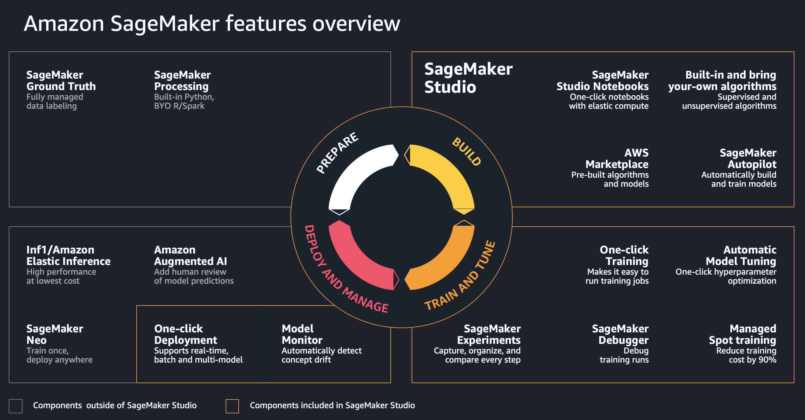

# MLOps
The goals of implementing MLOps for your Amazon SageMaker project are:
+ Operationalization of AI/ML workloads and workflowsxs
+ Create automated and reproducible ML workflows
+ Manage models with a model registry
+ Enable continious delivery with IaC and CI/CD pipelines
+ Monitor performance and feedback information to your models

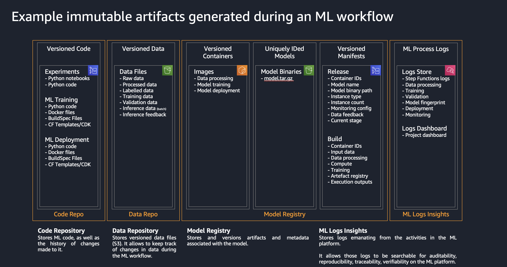

## Model registry
One of the key components of MLOps pipeline in Amazon SageMaker is the model registry.

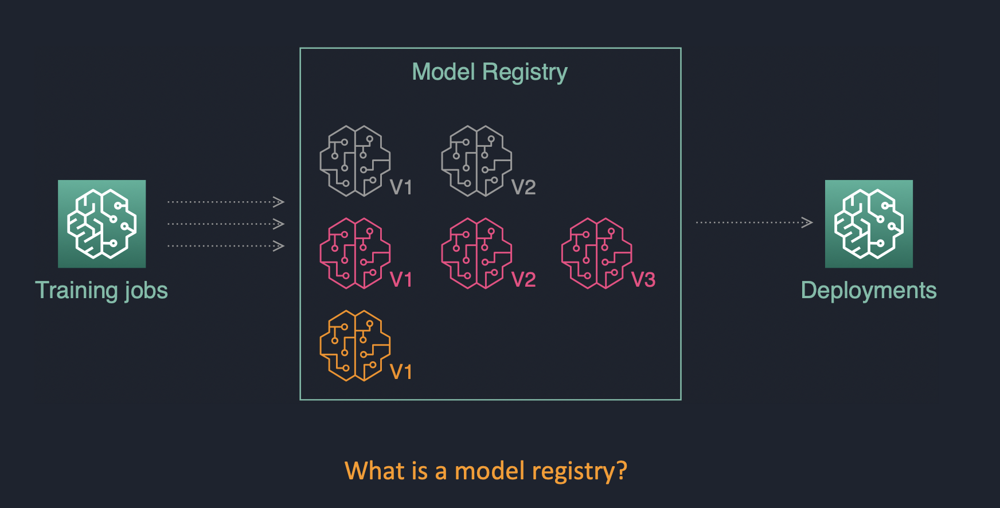

+ Centralized model storage and tracking service that stores lineage, versioning, and related metadata for ML models
+ Stores governance and audit data (e.g. who trained and published the model, which datasets were used)
+ Stores models metrics ad when the model was deployed to production

# Architectural options
The following architectural options for implementing MLOps pipeline are available:

+ SageMaker Projects + CodePipeline
+ [Step Functions](https://aws-step-functions-data-science-sdk.readthedocs.io/en/latest/readmelink.html#getting-started-with-sample-jupyter-notebooks)
+ [Apache AirFlow](https://airflow.apache.org/), [SageMaker Operators for AirFlow](https://sagemaker.readthedocs.io/en/stable/using_workflow.html)
+ [SageMaker Operators for Kubernetes](https://aws.amazon.com/blogs/machine-learning/introducing-amazon-sagemaker-operators-for-kubernetes/)

# PoC Architecture
This section describes a proposed PoC setup.

## AWS account, team, and project setup
The following diagram shows the proposed team and AWS account structure for the PoC:


The whole Sage Maker environment has a three-level organisational structure: Enterprise, Team (Environment), and Project.

+ **Enterprise** level: The highest level in hierarchy, represented by DS Administrator role and Data Science portfolio in AWS Service Catalog. A data science environment per team is provisioned via the AWS Service Catalog into a dedicated AWS Account
+ **Team/Environment** level: There is one dedicated Data Science Team AWS account and one SageMaker Studio domain per region. DS Team Administrator can create user profiles in SageMaker studio for different user roles and also provision a CI/CD MLOps pipeline per project. The DS Administrator role is responsible for approving ML models and deployment into staging and production accounts
+ **Project** level: This is the individual project level and represented by CI/CD pipelines which are provisioned via SageMaker projects in SageMaker studio

## User setup
Initial baselines for the IAM roles are taken from [Secure data science reference architecture](https://github.com/aws-samples/secure-data-science-reference-architecture).  
Four roles ML-related roles in Model Development Life Cycle (MDLC):  
+  **Data engineer**:
    - data sourcing
    - data quality assurance
    - data pre-processing
    - Feature engineering
    - develop data delivery pipelines (from the data source to destination S3 bucket where it is consumed by ML model/Data scientist)

    Permission baseline:
    - Data processing services (DMS, AWS Glue ETL, Athena, Kinesis, EMR, DataBrew, SageMaker, SageMaker Data Wrangler)
    - Data locations (S3, Data Lakes, Lake Formation)
    - Databases (RDS, Aurora, Redshift)
    - BI services (Grafana, Quicksight)
    - SageMaker notebooks

  ❗ This role is out of scope of this solution

+ **Data scientist**:
  “Project user” role for a DataScientist. This is baseline permissions. I think it’s fine for PoC, but for your real projects you probably need to trim the permission down. It uses the AWS managed permission policy for the job function `DataScientist`:  
    - Model training and evaluation in SageMaker, SageMaker Studio, Notebooks, SageMaker JumpStart (?)
    - Feature engineering
    - Starting ML pipelines
    - Deploy models to the model registry
    - GitLab permissions

    Permission baseline:
    - AWS managed policy `DataScientist`
    - Data locations (S3): only a defined set of S3 buckets (e.g. Data and Model)
    - SageMaker, SageMaker Studio, Notebooks

    Role definition: [JSON](iam/json/DataScientistRole.json), [CloudFormation](cfn_templates/iam-project-roles.yaml)

+ **Data science team administrator**:
   This is the admin role for a team or data science environment. In real-life setup you might want to add one more level of hiearchy and add an administrator role per project (or group of projects) – it creates a separation of duties between proejcts and minimize the blast radius. In this SageMaker PoC we are going to have one administrator role per team or "environment" (effectively meaning that Project Adminstrator = Team Administrator). The main responsibilities of the role are:  
    - ML infrastructure management and operations (endpoints, monitoring, scaling, reliability/high availability, BCM/DR)
    - Model hosting
    - Production integration
    - Model approval for deployment in staging and production
    - Project template (MLOps) provisioning
    - Create Jupyter notebook via the AWS Service Catalog
    - GitLab repository access

    Permission baseline:
    - PROD account
    - ML infrastructure
    - Data locations (S3)

    Role definition: [JSON](iam/json/DataScienceTeamAdministratorRole.json), [CloudFormation](cfn_templates/iam-project-roles.yaml)

+ **Data science administrator**:
  This is overarching admin role for the data science projects and setting up the secure SageMaker environment. It uses only AWS managed policies.
    - Shared Data Science infructure
    - Model approval for production
    - Deploys data science environments via the AWS Service Catalog

    Permission baseline:
    - Approvals (MLOps, Model registry, CodePipeline)
    - Permissions to deploy products from AWS Service Catalog  

    Role definition: [JSON](iam/json/DataScienceAdministratorRole.json), [CloudFormation](cfn_templates/iam-shared-roles.yaml)

A dedicated IAM role will be created for each persona/user. We start with a least possible permission set and will add necessary permissions when needed. 

The following diagram shows the IAM roles for personas/users and execution roles for services:

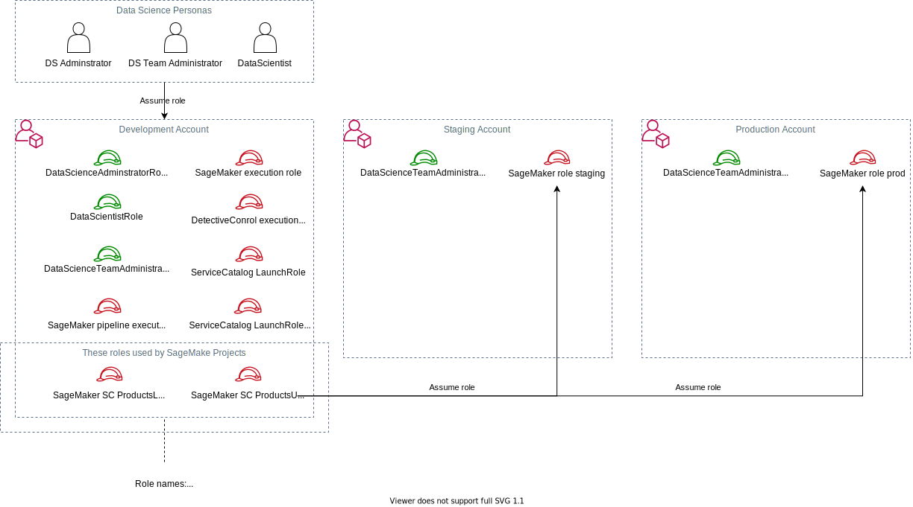

### IAM roles for Data Science personas
For PoC there is an assumption we are going to use three development accounts to simulate DEV, TEST, and PROD environments.The following describes how the IAM roles should be mapped to the accounts:  

#### IAM role to account mapping
**DEV account**:
  + All three roles must be created in the account: `DataScienceAdministratorRole`, `DataScienceProjectAdministratorRole`, `DataScientistRole`
 
**TEST and PROD accounts**:
  + Only `DataScienceProjectAdministratorRole` must be created on these accounts.


### IAM execution roles
IAM execution roles:
  + `SageMakerDetectiveControlExecutionRole`: for Lambda function to implement responsive security controls
  + `SCLaunchRole`: for AWS Service Catalog to deploy the whole SageMaker environment
  + `SageMakerExecutionRole`: execution role for the SageMaker workloads and Studio
  + `SCProjectLaunchRole`: for AWS Service Catalog to deploy project-specific products
  + `AmazonSageMakerServiceCatalogProductsUseRole`: for SageMaker project templates deployments
  + `AmazonSageMakerServiceCatalogProductsLaunchRole`: for SageMaker CI/CD execution
  + `SageMakerCrossAccountDeploymentRole`: cross-account deployment for SageMaker Model endpoints
  + `VPCFlowLogsRole`: optional role for VPC Flow Logs to write logs into a CloudWatch log group

## Account pipelines setup

The basis of a well-architected multi-account AWS environment is [AWS Organizations](https://aws.amazon.com/organizations/).
OUs should be based on function or common set of controls rather than mirroring company’s reporting structure

### OU setup for SageMaker PoC
```
Root
`--- OU SageMaker PoC
      |--- Data Science account
      `----OU Staging
            |--- Staging acccount
      `----OU Production
            |--- Production account
```

## SageMaker deployment in VPC 
The following deployment architecture is proposed for PoC:


The main design principles are:
+ Amazon SageMaker Studio domain is deployed in a dedicated VPC. Each ENI created by SageMaker is created within a dedicated subnet and attached to specified security groups
+ No internet access from `Data Science Project VPC`. For PoC internet access can be provided by adding a **NAT gateway**
+ Each SageMaker Studio domain (currently one per region and AWS account) is created in its own VPC for better isolation and small blast radius
+ All access to S3 is routed via S3 VPC endpoints
+ All access to AWS public services is routed via VPC endpoints
+ (Optionally for PoC) A PyPI repository mirror running on Fargate is hosted within your network
+ AWS Service Catalog is used to deploy all approved SageMaker resources (project templates, notebooks)
+ All user roles are deployed into Data Science account IAM

The initial setup creates the following IAM roles:
  + User roles:
    - **DataScienceAdministratorRole**: overall management of Data Science projects via AWS Service Catalog. Management of the AWS Service Catalog. Deployment of a Data Science environment (VPC, subnets, S3 bucket) to an AWS account
    - **DataScientistRole**: Data Scientist role within a specific project. Provisioned on per-project and per-stage (dev/test/prod) basis
    - **DataScienceTeamAdministratorRole**: Administrator role within a specific team or environment
  + Execution roles:
    - **ServiceCatalogLaunchRole**: the role used to launch a Data Science environment product from AWS Service Catalog
    - **DataScienceProjectServiceCatalogLaunchRole**:  the role used to launch project-related products (e.g. SageMaker Notebook) within a specific project
    - **DetectiveControlRole**: the role used by AWS Lambda function to inspect the setup of SageMaker resources and ensure they are attached to a VPC
    - **VPCFlowLogsRole**: the optional role is used by VPC Flow Logs to write the logs into a CloudWatch log group. You can bring your own existing IAM role.


## ML pipelines in multi-account setup with AWS Organizations
Functional architecture of PoC uses SageMaker MLOps Project templates as described in [AWS blog](https://aws.amazon.com/blogs/machine-learning/multi-account-model-deployment-with-amazon-sagemaker-pipelines/). The following diagram shows the components of SageMaker deployment for PoC:


The main design principles are:
+ MLOps project templates are deployed via AWS Service Catalog
+ Dedicated IAM user roles used to perform assigned actions/tasks in the environment
+ All project artefacts are connected via ProjectId ensuring a strong data governance and lineage

[Best practices for multi-account AWS environment](https://aws.amazon.com/organizations/getting-started/best-practices/)

## Model monitoring
AWS Services are used for model monitoring:
+ CloudWatch
+ SageMaker model monitoring

+ (option) Grafana
+ (option) Elasticsearch

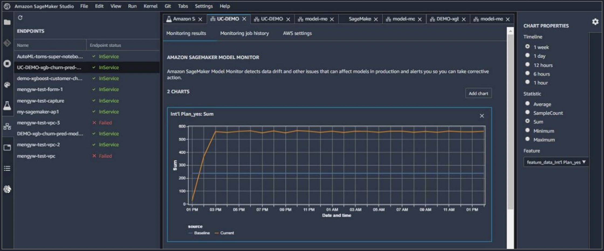

## Security

### Compute and network isolation
+ Can all traffic be transferred over private and secure network links?
+ Can we block ingress and egress Internet access?
+ What is the tenancy model and are segregated user-spaces available?

- [SageMaker Studio in VPC GitHub](https://github.com/aws-samples/amazon-sagemaker-studio-vpc-networkfirewall)
- [Building secure machine learning environments with Amazon SageMaker](https://aws.amazon.com/blogs/machine-learning/building-secure-machine-learning-environments-with-amazon-sagemaker/)

### Authentication
+ Is all access compliant with our corporate authentication standards?
+ Can all user interfaces integrate with our Active Directory?

### Autorization
+ How do we authorize access to all resources?
+ Can we limit access to data, code and training resources by role and job function?

### Data protection
+ Can we encrypt all data in-transit and at-rest?
+ Does the service support encryption with Amazon KMS customer managed keys (CMK)?

### Artifact management
+ How do we safely bring in public and private libraries and frameworks?
+ How do we securely persist and protect code and model artifacts?

### Auditability
+ Does the service provide end-to-end auditability?
+ Can audit trails be captured at user and file/object level?

### Security controls

#### Preventive
```
"Condition": {
  "Null": {
    "sagemaker:VpcSecurityGroupIds": "true"
  }
}
```

[List of IAM conditions policy](https://docs.aws.amazon.com/service-authorization/latest/reference/list_amazonsagemaker.html)

#### Detective

#### Responsive

# AWS Service Catalogue approach

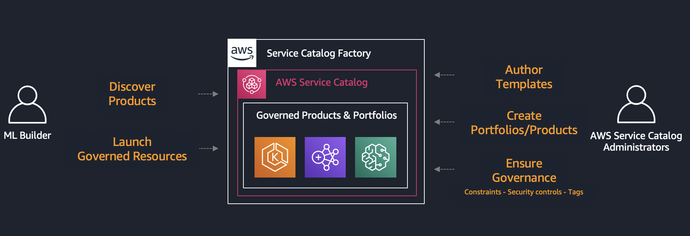

+ Sandbox defined via CloudFormation templates
+ Create and share immutable best-practice templates
+ Control access to underlying AWS services
+ Self-service access for all end users
+ Implement technology recommendations and patterns
+ Provide security and information privacy guardrails

**Governed and secure environments** are delivered via AWS Service Data catalog:
+ Research and train ML models
+ Share reproducible results
+ Develop data processing automation
+ Develop ML model training automation
+ Define ML Deployment resources
+ Test assets before Publishing

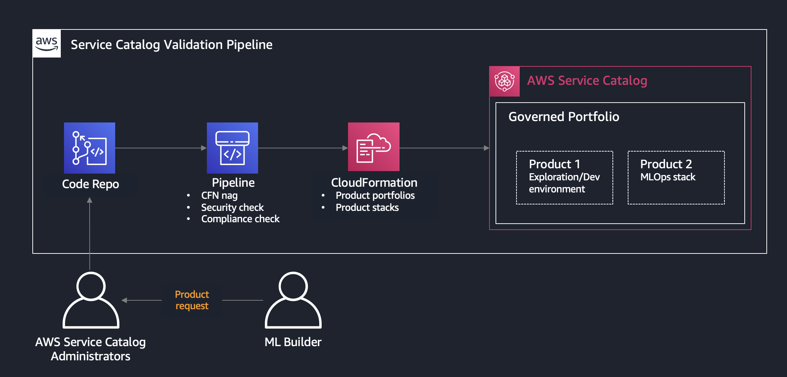

## AWS Service Catalog products in this PoC

### Data science environment product
This product provisions end-to-end data science environment (Amazon SageMaker Studio) for a specific Data Science team (SageMaker Studio Domain) and stage (dev/test/prod). It deploys the following team- and stage-specific resources:
  + VPC:
    - Dedicated `Data Science Team VPC`
    - Private subnets in each of the selected Availability Zones (AZ), up to four AZs are supported
    - If NAT gateway option is selected: NAT gateways and public subnets in each of the selected AZs 
  + VPC endpoints:
    - S3 VPC endpoint (`gateway` type) and endpoint policy to access the S3 data and model buckets. Only data and model buckets can be accessed
    - VPC endpoints (`interface` type) to access AWS public services (CloudWatch, SSM, SageMaker, CodeCommit)
    - VPC endpoint to access the `Shared services VPC`
  + Security Groups:
    - SageMaker security group for SageMaker resources. No ingress allowed
    - VPC endpoint security group for all VPC endpoints. **HTTPS 443 ingress only**
    - VPC endpoint security group to access the `Shared services VPC`. **HTTP 80 ingress only**
  + IAM roles:
    - Data Scientist IAM role
    - Data Science team administrator IAM role
  + AWS KMS:
    - KMS key for data encryption in S3 buckets
    - KMS key for data encryption on EBS volumes attached to SageMaker instances (for training, processing, batch jobs)
  + S3 buckets:
    - Amazon S3 data bucket with bucket policy. The S3 bucket is encrypted with AWS KMS key.
    - Amazon S3 model bucket with bucket policy. The S3 bucket is encrypted with AWS KMS key
  + Other resources:
    - (_Needs to be changed to `GitLab`_) CodeCommit repository with seed project code

  The S3 bucket policy explicitly denies all access which is **not originated** from the designated S3 VPC endpoint:
  ```json
  {
      "Version": "2008-10-17",
      "Statement": [
          {
              "Effect": "Deny",
              "Principal": "*",
              "Action": [
                  "s3:GetObject",
                  "s3:PutObject",
                  "s3:ListBucket"
              ],
              "Resource": [
                  "arn:aws:s3:::<s3-bucket-name>/*",
                  "arn:aws:s3:::<s3-bucket-name>"
              ],
              "Condition": {
                  "StringNotEquals": {
                      "aws:sourceVpce": "<s3-vpc-endpoint-id>"
                  }
              }
          }
      ]
  }
  ```

### Team-level Service-Catalog products

#### SageMaker notebook product
This product is available for Data Scientist and Data Science Team Administrator roles. Each notebook is provisioned with pre-defined lify-cycle configuration. The following considerations are applied to the notebook product:
+ Only some instance types are allowed to use in the notebook
+ Pre-defined notebook execution role is attached to the notebook
+ Notebook execution role enforce use of security configurations and controls (e.g. the notebook can be started only in VPC attachment mode)
+ Notebook has write access only to the projejct-specific S3 buckets (data and model as deployed by the Data Science Environment product)
+ Notebook-attached EBS volume is encrypted with its own AWS KMS key
+ Notebook is started in the SageMaker security group

#### SageMaker MLOps project templates
Available as project templates in the SageMaker Studio
Provisions end-to-end MLOps CI/CD for a specific project

#### User profile for SageMaker Studio domain
+ Each user profile has its own dedicated compute resource with a slice of the shared EFS file system
+ Each user profile can be associated with its own Execution Role (or use Domain role) (TBD for PoC)

## Self-service provisioning of ML environments

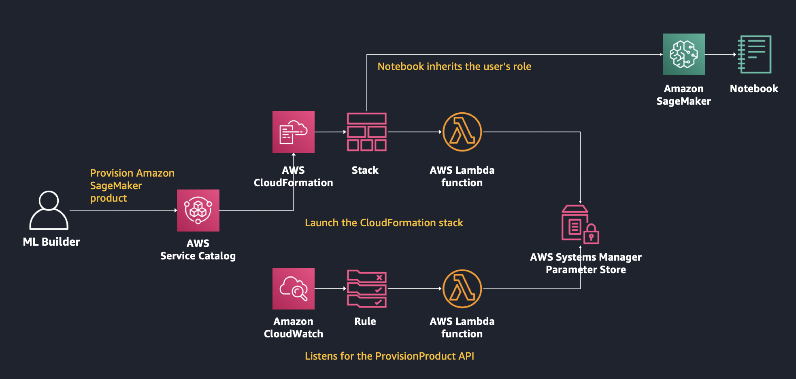

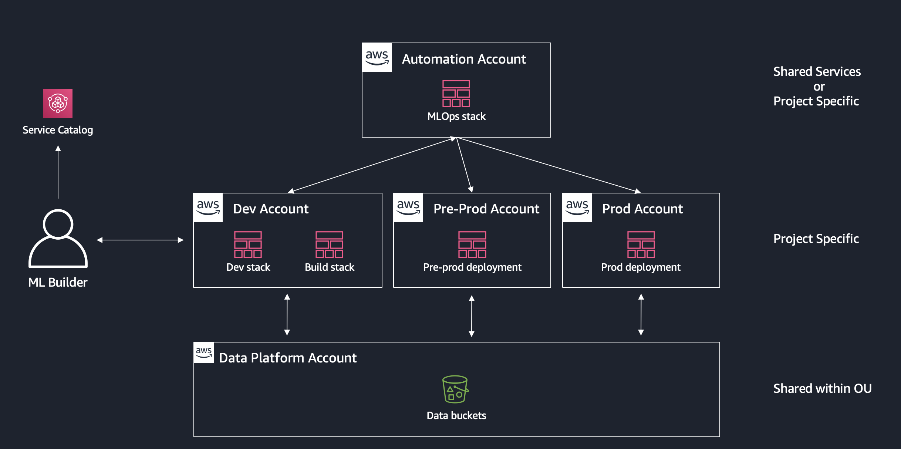

## Reusability between ML projects

# Terraform considerations

[AWS Service Catalog Terraform Reference Architecture GitHub](https://github.com/aws-samples/aws-service-catalog-terraform-reference-architecture)

[AWS Service Catalog FAQ](https://aws.amazon.com/servicecatalog/faqs/):
> Q: Can I use Terraform with AWS Service Catalog?  

> You can leverage the [AWS Service Catalog Terraform Reference Architecture](https://d1.awsstatic.com/whitepapers/DevOps/TerraformReferenceArchitecture-instructions.pdf). This reference architecture provides an example for using AWS Service Catalog products, an AWS CloudFormation custom resource, and Terraform to provision resources on AWS.

# MLOps part

MLOps Project template to build, train, deploy the model:

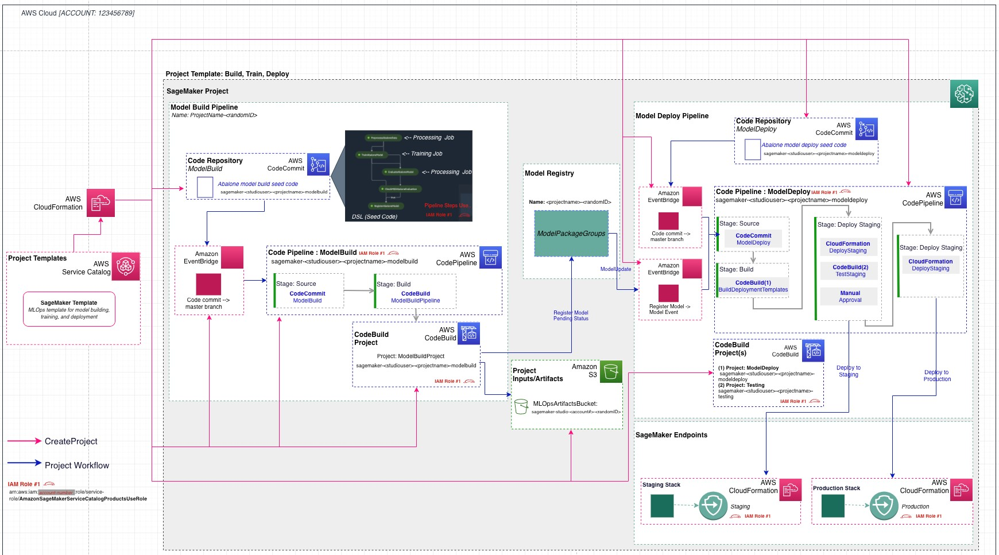


Seed code (deployed into the CodeCommit by CloudFormation template):
```yaml
'Type': 'AWS::CodeCommit::Repository'
   'Properties':
     'RepositoryName':
       'Fn::Sub': 'sagemaker-${SageMakerProjectName}-${SageMakerProjectId}-modelbuild'
     'RepositoryDescription':
       'Fn::Sub': 'SageMaker Model building workflow infrastructure as code for the
         Project ${SageMakerProjectName}'
     'Code':
       'S3':
         'Bucket': 'sagemaker-servicecatalog-seedcode-us-east-1'
         'Key': 'toolchain/model-building-workflow-v1.0.zip'
       'BranchName': 'main'
```

Multi-account deployment with CodePipeline:

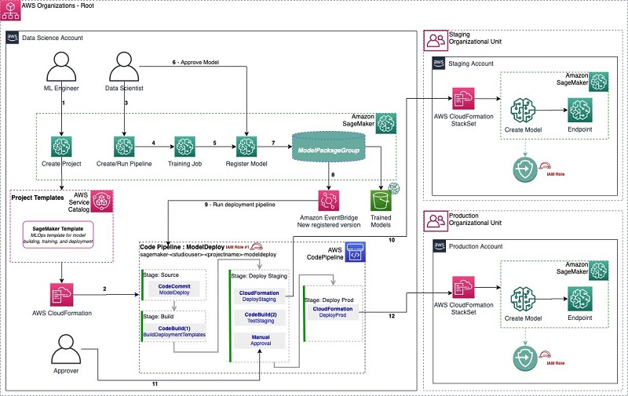

How to get an IAM snapshot from the account:
```
aws iam get-account-authorization-details > iam_snapshot.json
```

## Enabling SageMaker proejcts programmatically
To enable SageMaker projects you need first to enable SageMaker AWS Service Catalog portfolio and then to associate the Studio execution role with the portfolio using https://docs.aws.amazon.com/cli/latest/reference/servicecatalog/associate-principal-with-portfolio.html.

In addition you need to make sure to create two roles (which otherwise get created through the console): `AmazonSageMakerServiceCatalogProductsUseRole` and `AmazonSageMakerServiceCatalogProductsLaunchRole`.

Below a sample code_snippet for boto3 for the full workflow:
  + `studio_role_arn` is the role which is associated with sagemaker studio
  + `sc_client` is AWS Service Catalog boto3 client
  + `client`: is SageMaker boto3 client

```python
def enable_projects(studio_role_arn):
    # enable Project on account level (accepts portfolio share)
    response = client.enable_sagemaker_servicecatalog_portfolio()

    # associate studio role with portfolio
    response = sc_client.list_accepted_portfolio_shares()

    portfolio_id = ''
    for portfolio in response['PortfolioDetails']:
        if portfolio['ProviderName'] == 'Amazon SageMaker':
            portfolio_id = portfolio['Id']

    response = sc_client.associate_principal_with_portfolio(
        PortfolioId=portfolio_id,
        PrincipalARN=studio_role_arn,
        PrincipalType='IAM'
    )
```

# Deployment

❗ This is work in progress. This section will be changed significantly with each project iteration.

# Pre-requisites
The following guide assumes you have cloned the GitHub repository and will deploy the CloudFormation template from your terminal.

Alternatively, you can use the delivered CloudFormation templates and use them directly from the S3 bucket without cloning the GitHub repository.

You must have **Administrator** (or **Power User**) permissions to run the deployment commands and deploy the templates.

To follow along with the following instructions, run the following commands in your terminal (all commands are for MacOS/Linux)
```bash
git clone <git repository url>
cd sagemaker-secure-mlops

S3_BUCKET_NAME=<your S3 bucket name>
make package CFN_BUCKET_NAME=$S3_BUCKET_NAME
```

You can specify either a name for an existing S3 bucket or a new name (an S3 bucket will be created for you). If you use the existing S3 bucket, it must be in **the same region** where you are deploying the CloudFormation templates.

# Deployment options
You have a choice of different independent deployment options using the delivered CloudFormation templates:
+ **Data Science Environment Quickstart**: deploy end-to-end Data Science Environment with majority of options set to default values. _You can change only few deployment options_
+ **Two-step deployment via CloudFormation**: deploy the core infrastructure in the first step and then deploy a Data Science Environment, both as CloudFormation templates. CLI `aws cloudformation create-stack` is used for deployment. _You can change any deployment option_
+ **Two-step deployment via CloudFormation and AWS Service Catalog**: deploy the core infrastructure in the first step via `aws cloudformation create-stack` and then deploy a Data Science Environment via [AWS Service Catalog](https://aws.amazon.com/servicecatalog/). _You can change any deployment option_

The following sections give step-by-step deployment instructions for each of the options.

## Special deployment options
This special type of deployment is designed for an environment, where all IAM-changing operations (role and policy creation) are separated from the main deployment. All IAM roles for users and services and related IAM permission policies should be created as part of a separate process (separation of duties).  

The IAM part can be deployed using the delivered CloudFormation templates or completely separated out-of-stack.
You will provide the ARNs for the IAM roles as CloudFormation template parameters to deploy the Data Science environment.

See [Appendix B](README.md#AppendixB)

## Multi-region deployment considerations
The solution is designed for multi-region deployment. You can deploy end-to-end stack in any region of the AWS account. The following limitations and considerations apply:

+ The shared IAM roles (`DSAdministratorRole`, `SageMakerDetectiveControlExecutionRole`, `SCLaunchRole`) are created each time you deploy a new core infrastructure (`core-main`) or "quickstart" (`data-science-environment-quickstart`) stack. They created with `<StackName>-<RegionName>` prefix and designed to be unique within your end-to-end data science environment. For example, if you deploy one stack set (including core infrastructure and team data science environment) in one region and another stack in another region, these two stacks will not share any IAM roles and any users assuming any persona roles will have an independent set of permissions per stack set.
+ The environment IAM roles (`DSTeamAdministratorRole`, `DataScientistRole`, `SageMakerExecutionRole`, `SCProjectLaunchRole`, `SageMakerCrossAccountDeploymentRole`) are created with unique names. Each deployment of a new data science environment (via CloudFormation or via AWS Service Catalog) creates a set of unique roles
+ SageMaker Studio uses two pre-defined roles `AmazonSageMakerServiceCatalogProductsLaunchRole` and `AmazonSageMakerServiceCatalogProductsUseRole`. These roles are global for the AWS account and created by the first deployment of core infrastructure. These two roles have `Retain` deletion policy and _are not deleted_ when you delete the stack which has created these roles.

## Clean-up considerations
The deployment of Amazon SageMaker Studio creates a new EFS file system in your account. When you delete the data science enviroment stack, the SageMaker Studio domain, user profile and Apps are also deleted. However, the EFS file system **will not be deleted** and kept "as is" in your account (EFS file system contains home directories for SageMaker Studio users and may contain your data). 

❗ To delete all resources in your AWS account created by the deployment of this solution, do the following steps **after** running commands from **Clean-up** section for each deployment type:
+ From AWS console:
  - Go to the EFS console and delete all mounting points in all private subnets of the data science VPC
  - delete the EFS system. You may want to backup the EFS file system before deletion
  - Go to the VPC console and delete the data science VPC

## Data Science Environment Quickstart
This option deploys the end-to-end infrastructure and a Data Science Environment in one go.
You can change only few deployment options. The majority of the options are set to their default values.
  
📜 Use this option if you want to provision a _completely new set_ of the infrastructure and do not want to parametrize the deployment.

The only deployment options you can change are:
+ `CreateSharedServices`: default `NO`. Set to `YES` if you want to provision a shared services VPC with a private PyPI mirror (_not implemeted at this stage_)
+ `VPCIDR`: default `10.0.0.0/16`. CIDR block for the new VPC
+ Private and public subnets CIDR blocks: default `10.0.0.0/19`

Make sure you specify the CIDR blocks which do not conflict with your existing network IP ranges.

❗ You cannot use existing VPC or existing IAM roles to deploy this stack. The stack will provision a new own set of network and IAM resources.

Initiate the stack deployment with the following command:
```bash
STACK_NAME="ds-quickstart"
ENV_NAME="sagemaker-mlops"

aws cloudformation create-stack \
    --template-url https://s3.$AWS_DEFAULT_REGION.amazonaws.com/$S3_BUCKET_NAME/sagemaker-mlops/data-science-environment-quickstart.yaml \
    --region $AWS_DEFAULT_REGION \
    --stack-name $STACK_NAME \
    --disable-rollback \
    --capabilities CAPABILITY_NAMED_IAM \
    --parameters \
        ParameterKey=EnvName,ParameterValue=$ENV_NAME \
        ParameterKey=EnvType,ParameterValue=dev
```

The full end-to-end deployment takes about 25 minutes.

## Cleanup
After you have played with the environment, you can delete all resources as follows.
First, do the steps from **Clean-up considerations** section.
Second, delete the stack from AWS CloudFormation console or command line:
```bash
aws cloudformation delete-stack --stack-name ds-quickstart
```

## Two-step deployment via CloudFormation
Using this option you provision a Data Science environment in two steps, each with its own CloudFormation template. You can control all deployment parameters.  

📜 Use this option if you want to parametrize every aspect of the deployment based on your specific requirements and enviroment.

❗ You can select your existing VPC and network resources (subnets, NAT gateways, route tables) and existing IAM resources to be used for stack set deployment. Set the correspoinding CloudFormation parameters to names and ARNs or your existing resources.

### Step 1: Deploy the base infrastructure
In this step you deploy the _shared core infrastructure_ into your AWS Account. The stack (`core-main.yaml`) will provision:
1. Shared IAM roles for Data Science personas and services (optional)
2. A shared services VPC and related networking resources (optional)
3. An ECS Fargate cluster to run a private PyPi mirror (optional)
4. An AWS Service Catalog portfolio to provide a self-service deployment for the **Data Science administrator** user role (optional)
5. Security guardrails for your Data Science environment

The deployment options you can use are:
+ `CreateIAMRoles`: default `YES`. Set to `NO` if you have created the IAM roles outside of the stack (e.g. via a separate process) - Bring Your Own IAM Role (BYOR IAM)
+ `DSAdministratorRoleArn`: required if `CreateIAMRoles=NO`
+ `SCLaunchRoleArn`: required if `CreateIAMRoles=NO`
+ `SecurityControlExecutionRoleArn`: required if `CreateIAMRoles=NO`
+ `CreateSharedServices`: default `NO`. Set to `YES` if you would like to create a shared services VPC and an ECS Fargate cluster for a private PyPi mirror (_not implemented at this stage_)
+ `CreateSCPortfolio`: default `YES`. Set to `NO`if you don't want to to deploy an AWS Service Catalog portfolio with Data Science environment products

The following command uses the default values for the deployment options. You can specify parameters via `ParameterKey=<ParameterKey>,ParameterValue=<Value>` pairs in the `aws cloudformation create-stack` call:
```bash
STACK_NAME="sm-mlops-core"

aws cloudformation create-stack \
    --template-url https://s3.$AWS_DEFAULT_REGION.amazonaws.com/$S3_BUCKET_NAME/sagemaker-mlops/core-main.yaml \
    --region $AWS_DEFAULT_REGION \
    --stack-name $STACK_NAME  \
    --disable-rollback \
    --capabilities CAPABILITY_IAM CAPABILITY_NAMED_IAM \
    --parameters \
        ParameterKey=StackSetName,ParameterValue=$STACK_NAME
```

Show the stack output:
```bash
aws cloudformation describe-stacks \
    --stack-name sm-mlops-core  \
    --output table \
    --query "Stacks[0].Outputs[*].[OutputKey, OutputValue]"
```

### Step 2: Deploy a Data Science environment

The step 2 CloudFormation template (`env-main.yaml`) provides two deployment options:
+ **Deploy Amazon SageMaker Studio into a new VPC**: This option provisions a new AWS network infrastruture consisting of:
   - VPC
   - private subnets in each AZ
   - optional public subnets in each AZ. The public subnets are provisioned only if you chose to create NAT gateways
   - VPC endpoints to access public AWS services and Amazon S3 buckets
   - security groups
   - optional NAT gateways in each AZ  
   - if you select the NAT gateway option, an internet gateway will be created and attached to the VPC
   - routing tables and routes for private and public subnets

You specify the number of AZs and CIDR blocks for VPC and each of the subnets.  
After provisioning the network infrastructure, the solution deploys SageMaker Studio into this VPC.  

+ **Deploy Amazon SageMaker Studio into an existing VPC**: This option provisions SageMaker Studio in your existing AWS network infrastructure. You have several options to choose between existing or create new network resources:
  - VPC: you must provide a valid existing VPC Id
  - Subnets: you can choose between:
    - providing existing subnet CIDR blocks (set `CreatePrivateSubnets` to `NO`) - in this case no new subnets are provisioned and NAT gateway option **is not available**. All SageMaker resources are deployed into your existing VPC and private subnets. You use your existing NAT (if available) to access internet from the private subnets
    - provisioning new private (set `CreatePrivateSubnets` to `NO`) and optional (only if the NAT gateway option is selected) public subnets. The deployment creates new subnets with specified CIDR blocks inside your existing VPC.

You must specify the number of AZs you would like to deploy the network resources into.  

❗ A new internet gateway will be created and attached to the VPC in "existing VPC" scenario if you select the NAT gateway option. The stack creation will fail if there is an internet gateway _already attached_ to the existing VPC and you select the NAT gateway option.

Example of the existing VPC infrastructure:

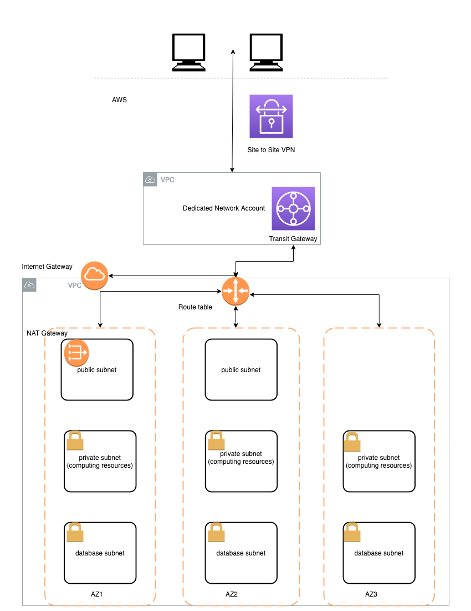

The Data Science environment deployment will provision the following resources in your AWS account:
+ environment-specific IAM roles (optional)
+ a VPC with all network infrastructure for the environment (optional) - see the considerations above
+ VPC endpoints to access the environment Amazon S3 buckets and AWS public services via private network
+ KMS keys for data encryption 
+ two S3 buckets for environment data and model artefacts
+ AWS Service Catalog portfolio with environment-specific products
+ SageMaker Studio domain and default user profile

The deployment options you can use are:
+ Data Science environment
  - `EnvName`:
  - `EnvType`:
+ Deployment options:
  - `CreateEnvironmentIAMRoles`:
  - `CreateEnvironmentS3Buckets`:
  - `CreateS3VPCEndpoint`:
  - `CreateSageMakerStudioDomain`:
  - `UseSharedServicesPyPiMirror`:
+ Environment IAM roles (only needed if created outside of this stack and `CreateEnvironmentIAMRoles` = NO):
  - `DSTeamAdministratorRoleArn`
  - `DataScientistRoleArn`
  - `SageMakerExecutionRoleArn`
  - `SetupLambdaExecutionRoleArn`
  - `SCProjectLaunchRoleArn`
+ Availability Zone configuration:
  - `AvailabilityZones`
  - `NumberOfAZs`
+ Network Configuration:
  - `CreateVPC`
  - `CreateNATGateways`
  - `ExistingVPCId`
  - `VPCCIDR`
  - `ExistingS3VPCEndpointId`
  - `CreatePrivateSubnets`
  - `PrivateSubnet1ACIDR`
  - `PrivateSubnet2ACIDR`
  - `PrivateSubnet3ACIDR`
  - `PrivateSubnet4ACIDR`
  - `PublicSubnet1CIDR`
  - `PublicSubnet2CIDR`
  - `PublicSubnet3CIDR`
  - `PublicSubnet4CIDR`
+ VPC Flow Logs Configuration:
  - `CreateVPCFlowLogsToCloudWatch`
  - `CreateVPCFlowLogsRole`
  - `VPCFlowLogsRoleArn`
  - `VPCFlowLogsLogFormat`
  - `VPCFlowLogsLogGroupRetention`
  - `VPCFlowLogsMaxAggregationInterval`
  - `VPCFlowLogsTrafficType`
  - `VPCFlowLogsCloudWatchKMSKey`

Run command providing the deployment options for your environment. The following command uses the minimal set of the options:
```bash
STACK_NAME="sagemaker-mlops-env"
ENV_NAME="sagemaker-mlops"
AVAILABILITY_ZONES=${AWS_DEFAULT_REGION}a

aws cloudformation create-stack \
    --template-url https://s3.$AWS_DEFAULT_REGION.amazonaws.com/$S3_BUCKET_NAME/sagemaker-mlops/env-main.yaml \
    --region $AWS_DEFAULT_REGION \
    --stack-name $STACK_NAME \
    --disable-rollback \
    --capabilities CAPABILITY_IAM CAPABILITY_NAMED_IAM \
    --parameters \
        ParameterKey=EnvName,ParameterValue=$ENV_NAME \
        ParameterKey=EnvType,ParameterValue=dev \
        ParameterKey=AvailabilityZones,ParameterValue=$AVAILABILITY_ZONES \
        ParameterKey=NumberOfAZs,ParameterValue=1
```

## Cleanup
First, delete the two root stacks from AWS CloudFormation console or command line:
```bash
aws cloudformation delete-stack --stack-name sagemaker-mlops-env
aws cloudformation delete-stack --stack-name sm-mlops-core
```
Second, do the steps from **Clean-up considerations** section.

## Two-step deployment via CloudFormation and AWS Service Catalog
This deployment option first deploys the core infrastructure including the AWS Service Catalog portfolio of Data Science products. In the second step, the Data Science Administrator deploys a Data Science environment via the AWS Service Catalog.  

📜 Use this option if you want to similate the end user experience in provisioning a Data Science environment via AWS Service Catalog

❗ You can select your existing VPC and network resources (subnets, NAT gateways, route tables) and existing IAM resources to be used for stack set deployment. Set the correspoinding CloudFormation and AWS Service Catalog product parameters to names and ARNs or your existing resources.

### Step 1: Deploy the base infrastructure
Same as Step 1 from **Two-step deployment via CloudFormation**

### Step 2: Deploy a Data Science environment via AWS Service Catalog
After the base infrastructure is provisioned, data scientists and other users can assume the DS Administrator IAM role (`AssumeDSAdministratorRole`) via link in the CloudFormation output. In this role, the users can browse the AWS Service Catalog and then provision a secure SageMaker Studio environment.

First, show the output from the stack deployment in Step 1:
```bash
aws cloudformation describe-stacks \
    --stack-name sm-mlops-core  \
    --output table \
    --query "Stacks[0].Outputs[*].[OutputKey, OutputValue]"
```

Copy and paste the `AssumeDSAdministratorRole` link to a web browser and switch role to DS Administrator.
Go to AWS Service Catalog in the AWS console and select **Products** on the left pane:
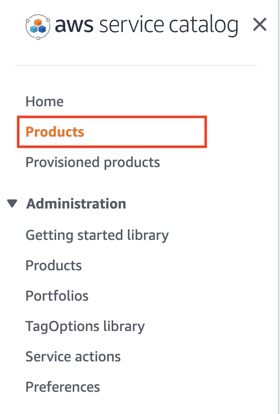

 You will see the list of available products for your user role:

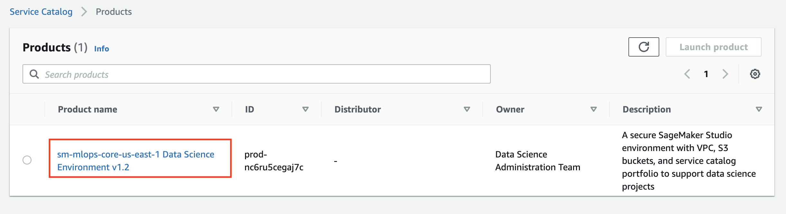

Click on the product name and and then on the **Launch product** on the product page:

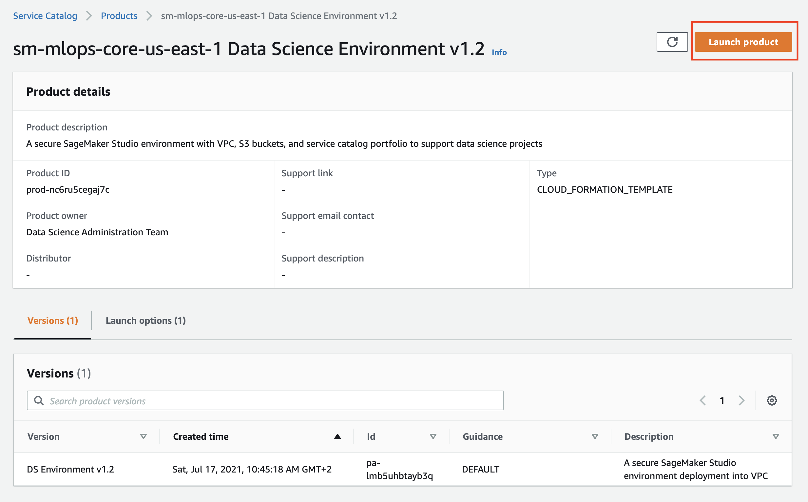

Fill the product parameters specific for your environment. 

Wait until AWS Service Catalog finishes the provisioning of the Data Science environment stack and the product status becomes **Available**:

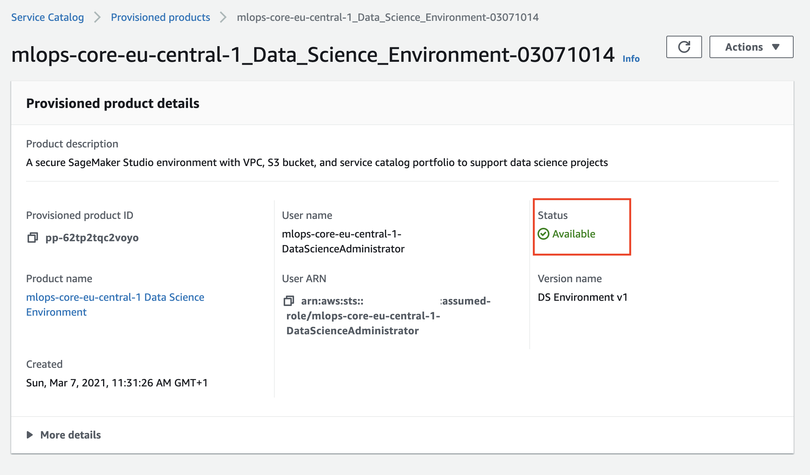

Now you provisined the Data Science environment and can start working with it.

## Cleanup
First, do the following steps:
+ In AWS Service Catalog console go to the _Provisioned Products_, select your product and click **Terminate** from the **Action** button. Wait until the delete process ends.
+ Delete the core infrastructure CloudFormation stack:
```bash
aws cloudformation delete-stack --stack-name sm-mlops-core
```
Second, do the steps from **Clean-up considerations** section.

# Resources

- [R1]: [Amazon SageMaker Pipelines documentation](https://docs.aws.amazon.com/sagemaker/latest/dg/pipelines-sdk.html)
- [R2]: [Best practices for multi-account AWS environment](https://aws.amazon.com/organizations/getting-started/best-practices/)
- [R3]: [AWS Well-Architected Framework - Machine Learning Lens Whitepaper](https://d1.awsstatic.com/whitepapers/architecture/wellarchitected-Machine-Learning-Lens.pdf)  
- [R4]: [Terraform provider AWS GitHub](https://github.com/hashicorp/terraform-provider-aws)
- [R5]: [Data processing options for AI/ML](https://aws.amazon.com/blogs/machine-learning/data-processing-options-for-ai-ml/)
- [R6]: [Architect and build the full machine learning lifecycle with AWS: An end-to-end Amazon SageMaker demo](https://aws.amazon.com/blogs/machine-learning/architect-and-build-the-full-machine-learning-lifecycle-with-amazon-sagemaker/)
- [R7]: [End-to-end Amazon SageMaker demo](https://github.com/aws/amazon-sagemaker-examples/tree/master/end_to_end)
- [R8]: [Multi-account model deployment with Amazon SageMaker Pipelines](https://aws.amazon.com/blogs/machine-learning/multi-account-model-deployment-with-amazon-sagemaker-pipelines/)
- [R9]: [Building, automating, managing, and scaling ML workflows using Amazon SageMaker Pipelines](https://aws.amazon.com/blogs/machine-learning/building-automating-managing-and-scaling-ml-workflows-using-amazon-sagemaker-pipelines/)
- [R10]: [Best Practices for Organizational Units with AWS Organizations](https://aws.amazon.com/blogs/mt/best-practices-for-organizational-units-with-aws-organizations/)


## Secure ML environments
- [S1]: [Building secure machine learning environments with Amazon SageMaker](https://aws.amazon.com/blogs/machine-learning/building-secure-machine-learning-environments-with-amazon-sagemaker/)
- [S2]: [Secure Data Science Reference Architecture GitHub](https://github.com/aws-samples/secure-data-science-reference-architecture)
- [S3]: [SageMaker Notebook instance lifecycle config samples GitHub](https://github.com/aws-samples/amazon-sagemaker-notebook-instance-lifecycle-config-samples)
- [S4]: [Securing Amazon SageMaker Studio connectivity using a private VPC](https://aws.amazon.com/blogs/machine-learning/securing-amazon-sagemaker-studio-connectivity-using-a-private-vpc/)
- [S5]: [Secure deployment of Amazon SageMaker resources](https://aws.amazon.com/blogs/security/secure-deployment-of-amazon-sagemaker-resources/)
- [S6]: [Understanding Amazon SageMaker notebook instance networking configurations and advanced routing options](https://aws.amazon.com/blogs/machine-learning/understanding-amazon-sagemaker-notebook-instance-networking-configurations-and-advanced-routing-options/)
- [S7]: [Security group rules for different use cases](https://docs.aws.amazon.com/AWSEC2/latest/UserGuide/security-group-rules-reference.html)
- [S8]: [Data encryption at rest in SageMaker Studion](https://docs.aws.amazon.com/sagemaker/latest/dg/encryption-at-rest-studio.html)
- [S9]: [Connect SageMaker Studio Notebooks to Resources in a VPC](https://docs.aws.amazon.com/sagemaker/latest/dg/studio-notebooks-and-internet-access.html)
- [S10]: [Control root access to Amazon SageMaker notebook instances](https://aws.amazon.com/blogs/machine-learning/control-root-access-to-amazon-sagemaker-notebook-instances/)

## Workshops
- [W1]: [SageMaker immersion day GitHub](https://github.com/aws-samples/amazon-sagemaker-immersion-day)  
- [W2]: [SageMaker immersion day workshop](https://sagemaker-immersionday.workshop.aws/)  
- [W3]: [Amazon Sagemaker MLOps workshop GitHub](https://github.com/awslabs/amazon-sagemaker-mlops-workshop)
- [W4]: [Operationalizing the ML pipeline workshop](https://operational-machine-learning-pipeline.workshop.aws/)
- [W5]: [Safe MLOps deployment pipeline](https://mlops-safe-deployment-pipeline.workshop.aws/)
- [W6]: [Buiding secure environments workshop](https://sagemaker-workshop.com/security_for_sysops.html)

## Amazon SageMaker with Guardrails on AWS reference deployment
- [Amazon SageMaker with Guardrails on AWS](https://aws.amazon.com/quickstart/architecture/amazon-sagemaker-with-guardrails/)
- [Amazon SageMaker with Guardrails on AWS Deployment Guide](https://aws-quickstart.github.io/quickstart-brillio-aws-service-catalog-amazon-sagemaker/)
- [Amazon SageMaker with Guardrails on AWS GitHub](https://github.com/aws-quickstart/quickstart-brillio-aws-service-catalog-amazon-sagemaker)

## MLOps and ML production related resources
- https://github.com/visenger/awesome-mlops
- https://github.com/EthicalML/awesome-production-machine-learning
- https://github.com/alirezadir/Production-Level-Deep-Learning
- https://www.featurestore.org/
- https://twitter.com/chipro/status/1318190833141714949?s=20
- [TWIML podcast: Feature Stores for MLOps with Mike del Balso](https://twimlai.com/feature-stores-for-mlops-with-mike-del-balso/)
- [TWIML podcast: Enterprise Readiness, MLOps and Lifecycle Management with - - Jordan Edwards](https://twimlai.com/twiml-talk-321-enterprise-readiness-mlops-and-lifecycle-management-with-jordan-edwards/)
- [Full stack deep learning free online course](https://course.fullstackdeeplearning.com/)
- [Continuous Delivery for Machine Learning](https://martinfowler.com/articles/cd4ml.html)
- [Feature Store vs Data Warehouse](https://medium.com/data-for-ai/feature-store-vs-data-warehouse-306d1567c100)
- [Seldon Core](https://docs.seldon.io/projects/seldon-core/en/latest/)
- [MLflow and PyTorch — Where Cutting Edge AI meets MLOps](https://medium.com/pytorch/mlflow-and-pytorch-where-cutting-edge-ai-meets-mlops-1985cf8aa789)
- [5 Lessons Learned Building an Open Source MLOps Platform](https://towardsdatascience.com/5-lessons-learned-building-an-open-source-mlops-platform-624574a44c09)

## Internal
- [I1]: [AWS Answers: How to integrate Terraform with CI/CD for SageMaker endpoints?](https://answers.amazon.com/posts/172062)
- [I2]: [AWS Answers: Enabling SageMaker projects programatically](https://answers.amazon.com/posts/175683)
- [I3]: [Event Engine SageMaker Studio Module](https://gitlab.aws.dev/anamarto/event-engine-sagemaker-studio-module/-/blob/master/cf.yaml)
- [I4]: [AWS Answers: Simplifying deployment of SageMaker Training and Hosting within a VPC](https://answers.amazon.com/posts/70288)
- [I5]: [AWS Answers: SageMaker and Network Isolation Mode](https://answers.amazon.com/posts/180757)
- [I6]: [AWS AI/ML FSI SageMaker Reference Architectures](https://aws.highspot.com/items/5dbcc8e3429d7b513bfdfd58?lfrm=srp.0#19)
- [I7]: [Secure SageMaker Notebook CDK](https://code.amazon.com/packages/SecureSagemakerNotebookCDK)


https://amazon.awsapps.com/workdocs/index.html#/folder/b0b6fc4f9f318f97efce607ae05c737122be0614b0597718f2c25a5d217e9c2a

https://amazon.awsapps.com/workdocs/index.html#/folder/b8703c8450b10af9c4e8c3ba746426a9a72406572266ef534225bddc22f0dc2b

# AppendixA

## SageMaker default network mode

> In a default SageMaker implementation (without network isolation or VPC ENIs), processing jobs, training jobs, notebooks, etc can reach the internet. The image below shows how this works for training jobs. The jobs themselves run in an AWS-owned account, inside an AWS-owned VPC. These instances access the data in an S3 bucket in the Customer account through the internet [I5].

[SageMaker Developer Guide](https://docs.aws.amazon.com/sagemaker/latest/dg/train-vpc.html)

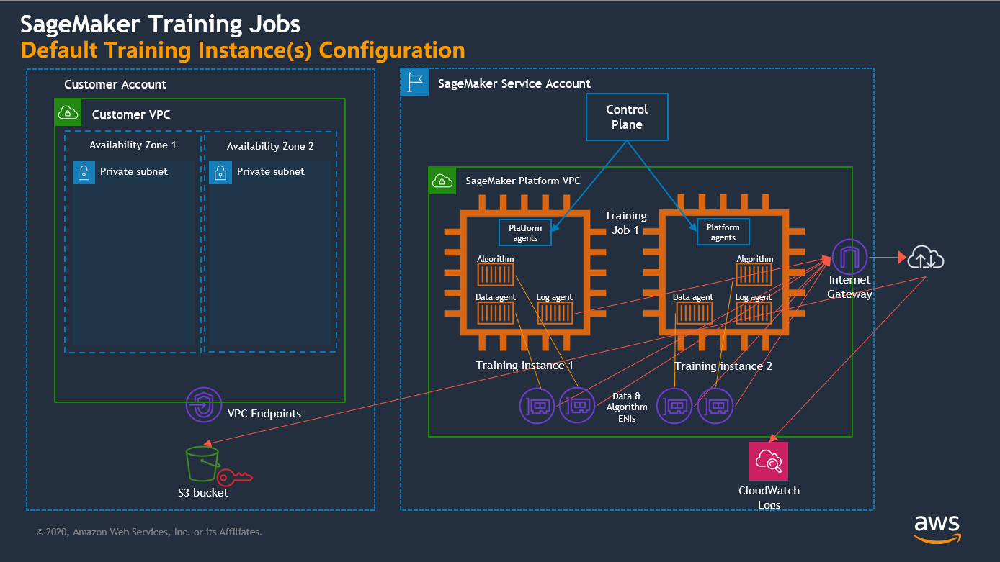

## SageMaker VPC deployment
When you specify the subnets and security groups, SageMaker creates elastic network interfaces that are associated with your security groups in one of the subnets. Network interfaces allow your training containers to connect to resources in your VPC [Source](https://docs.aws.amazon.com/sagemaker/latest/dg/train-vpc.html).

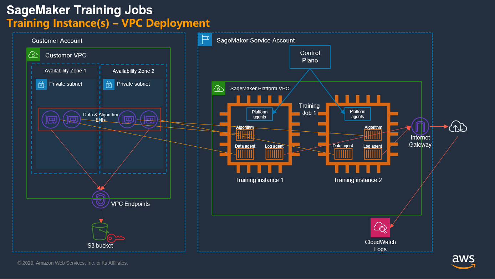

> Note that you need to add a VPC Endpoint to your VPC to access some AWS services like S3. In this case, network isolation is disabled so there is still the ability for egress over public connectivity and pulling packages from external sources. Having connectivity run through the customer VPC might be enough security for your customer depending on what they are trying to achieve [I5].

### Network isolation mode

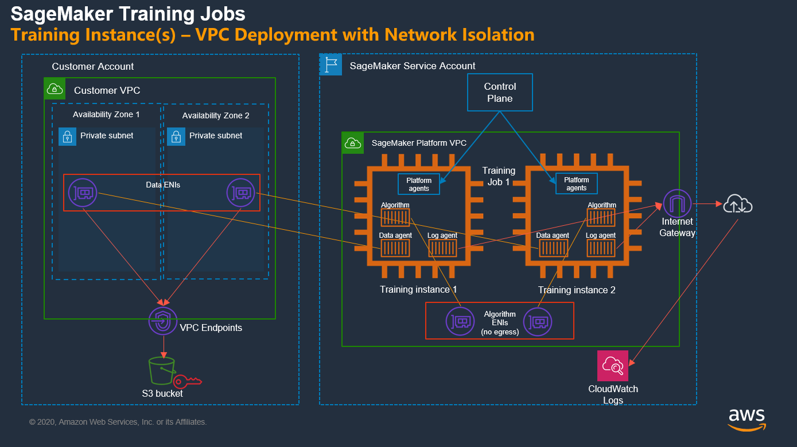

### SageMaker Studio Domain
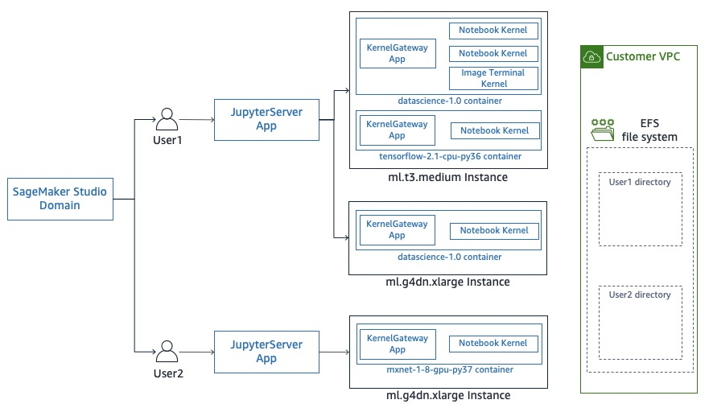

# AppendixB

## Deployment into an existing VPC and with pre-provisioned IAM resources
This deployment option is a special case where the solution is deployed into an AWS account with an existing VPC, network resources and pre-provisioned IAM roles.

## Prepare the CloudFormation templates
```bash
S3_BUCKET_NAME=<your S3 bucket name>
make package CFN_BUCKET_NAME=$S3_BUCKET_NAME
```

## Deploy VPC, network and IAM resources
Skip these sub-steps and go directly to **Deploy Data Science Environment** if you have your own procedure for provisioning VPC, subnets, network connectivity, route tables, and IAM resources. 

### Deploy VPC
For VPC deployment we use the [VPC Quick Start Reference Deployment](https://fwd.aws/9VdxN).  
We deploy VPC with private and public subnets, NAT gateways in two Availability Zones:

```bash
STACK_NAME="ds-team-vpc"

aws cloudformation create-stack \
    --template-url https://aws-quickstart.s3.amazonaws.com/quickstart-aws-vpc/templates/aws-vpc.template.yaml \
    --region $AWS_DEFAULT_REGION \
    --stack-name $STACK_NAME \
    --disable-rollback \
    --capabilities CAPABILITY_IAM CAPABILITY_NAMED_IAM \
    --parameters \
        ParameterKey=AvailabilityZones,ParameterValue=${AWS_DEFAULT_REGION}a\\,${AWS_DEFAULT_REGION}b \
        ParameterKey=NumberOfAZs,ParameterValue=2
```

### Deploy IAM resources
Deploy SageMaker Service Catalog project roles. Run the following step **only** if `AmazonSageMakerServiceCatalogProductsLaunchRole` and `AmazonSageMakerServiceCatalogProductsLaunchRole` **do not** exist yet:
```bash
aws cloudformation deploy \
                --template-file build/$AWS_DEFAULT_REGION/core-iam-sc-sm-projects-roles.yaml \
                --stack-name core-iam-sc-sm-projects-roles \
                --capabilities CAPABILITY_NAMED_IAM 
```

Deploy IAM shared roles:
```bash
STACK_SET_NAME=ds-team

aws cloudformation deploy \
                --template-file build/$AWS_DEFAULT_REGION/core-iam-shared-roles.yaml \
                --stack-name core-iam-shared-roles \
                --capabilities CAPABILITY_NAMED_IAM \
                --parameter-overrides \
                    DSAdministratorRoleName=$STACK_SET_NAME-$AWS_DEFAULT_REGION-DataScienceAdministrator \
                    SageMakerDetectiveControlExecutionRoleName=$STACK_SET_NAME-$AWS_DEFAULT_REGION-DSSageMakerDetectiveControlRole \
                    SCLaunchRoleName=$STACK_SET_NAME-$AWS_DEFAULT_REGION-DSServiceCatalogLaunchRole
```

Deploy IAM DS environment roles:
```bash
ENV_NAME=ds-team

aws cloudformation deploy \
                --template-file build/$AWS_DEFAULT_REGION/env-iam.yaml \
                --stack-name env-iam-roles \
                --capabilities CAPABILITY_NAMED_IAM \
                --parameter-overrides \
                EnvName=$ENV_NAME \
                EnvType=dev
```

Deploy IAM cross-account roles
```bash
aws cloudformation deploy \
                --template-file build/$AWS_DEFAULT_REGION/env-iam-cross-account-deployment-role.yaml \
                --stack-name env-iam-cross-account-deployment-role \
                --capabilities CAPABILITY_NAMED_IAM \
                --parameter-overrides \
                EnvName=$ENV_NAME \
                EnvType=dev \
                PipelineExecutionRoleArn=arn:aws:iam::ACCOUNT_ID:role/service-role/AmazonSageMakerServiceCatalogProductsUseRole
```

Show IAM role ARNs:
```bash
aws cloudformation describe-stacks \
    --stack-name core-iam-shared-roles  \
    --output table \
    --query "Stacks[0].Outputs[*].[OutputKey, OutputValue]"

aws cloudformation describe-stacks \
    --stack-name env-iam-roles  \
    --output table \
    --query "Stacks[0].Outputs[*].[OutputKey, OutputValue]"
```

## Deploy Data Science Environment
Provide your specific parameter values for all deployment calls below.

### Deploy core infrastructure
```bash
STACK_NAME="ds-team-core"

aws cloudformation create-stack \
    --template-url https://s3.$AWS_DEFAULT_REGION.amazonaws.com/$S3_BUCKET_NAME/sagemaker-mlops/core-main.yaml \
    --region $AWS_DEFAULT_REGION \
    --stack-name $STACK_NAME  \
    --disable-rollback \
    --parameters \
        ParameterKey=StackSetName,ParameterValue=$STACK_NAME \
        ParameterKey=CreateIAMRoles,ParameterValue=NO \
        ParameterKey=DSAdministratorRoleArn,ParameterValue= \
        ParameterKey=SecurityControlExecutionRoleArn,ParameterValue= \
        ParameterKey=SCLaunchRoleArn,ParameterValue=
```

```bash
# show the assume DSAdministrator role link
aws cloudformation describe-stacks \
    --stack-name ds-team-core  \
    --output table \
    --query "Stacks[0].Outputs[*].[OutputKey, OutputValue]"

# show shared IAM roles
aws cloudformation describe-stacks \
    --stack-name env-iam-roles  \
    --output table \
    --query "Stacks[0].Outputs[*].[OutputKey, OutputValue]"

# show VPC info (only if you deployed the VPC stack `ds-team-vpc`)
aws cloudformation describe-stacks \
    --stack-name ds-team-vpc  \
    --output table \
    --query "Stacks[0].Outputs[*].[OutputKey, OutputValue]"
```

### Deploy DS environment
```bash
STACK_NAME="ds-team-env"
ENV_NAME="ds-team-env"

aws cloudformation create-stack \
    --template-url https://s3.$AWS_DEFAULT_REGION.amazonaws.com/$S3_BUCKET_NAME/sagemaker-mlops/env-main.yaml \
    --region $AWS_DEFAULT_REGION \
    --stack-name $STACK_NAME \
    --disable-rollback \
    --parameters \
        ParameterKey=EnvName,ParameterValue=$ENV_NAME \
        ParameterKey=EnvType,ParameterValue=dev \
        ParameterKey=CreateEnvironmentIAMRoles,ParameterValue=NO \
        ParameterKey=CreateS3VPCEndpoint,ParameterValue=NO \
        ParameterKey=DSTeamAdministratorRoleArn,ParameterValue= \
        ParameterKey=DataScientistRoleArn,ParameterValue=  \
        ParameterKey=SageMakerExecutionRoleArn,ParameterValue= \
        ParameterKey=SetupLambdaExecutionRoleArn,ParameterValue=  \
        ParameterKey=SCProjectLaunchRoleArn,ParameterValue= \
        ParameterKey=CreateVPC,ParameterValue=NO \
        ParameterKey=CreateNATGateways,ParameterValue=NO \
        ParameterKey=ExistingVPCId,ParameterValue= \
        ParameterKey=ExistingS3VPCEndpointId,ParameterValue= \
        ParameterKey=CreatePrivateSubnets,ParameterValue=NO \
        ParameterKey=PrivateSubnet1ACIDR,ParameterValue= \
        ParameterKey=PrivateSubnet2ACIDR,ParameterValue= \
        ParameterKey=PrivateSubnet3ACIDR,ParameterValue=  \
        ParameterKey=CreateVPCFlowLogsToCloudWatch,ParameterValue=NO \
        ParameterKey=CreateVPCFlowLogsRole,ParameterValue=NO \
        ParameterKey=AvailabilityZones,ParameterValue=${AWS_DEFAULT_REGION}a\\,${AWS_DEFAULT_REGION}b\\,${AWS_DEFAULT_REGION}c \
        ParameterKey=NumberOfAZs,ParameterValue=3
```

## Clean-up
```bash
aws cloudformation delete-stack --stack-name ds-team-env
aws cloudformation delete-stack --stack-name ds-team-core
aws cloudformation delete-stack --stack-name env-iam-cross-account-deployment-role
aws cloudformation delete-stack --stack-name env-iam-roles
aws cloudformation delete-stack --stack-name core-iam-shared-roles
aws cloudformation delete-stack --stack-name ds-team-vpc
```

# AppendixC

## Solution CI/CD pipelines
The solution is tested end-to-end for all possible depoyment options using [AWS CodePipeline](https://aws.amazon.com/codepipeline/) and AWS developer tools.

## Setup CI/CD pipelines
### Create CodePipeline artifact Amazon S3 buckets
The CodePipeline pipelines used in the solution deploy stack in different regions. You must create an Amazon S3 CodePipeline bucket per region following the naming convention: `codepipeline-<ProjectName>-<AWS Region>`:

```
PROJECT_NAME=sm-mlops
aws s3 mb s3://codepipeline-${PROJECT_NAME}-us-east-2 --region us-east-2
aws s3 mb s3://codepipeline-${PROJECT_NAME}-eu-central-1 --region eu-central-1
aws s3 mb s3://codepipeline-${PROJECT_NAME}-eu-west-1 --region eu-west-1
aws s3 mb s3://codepipeline-${PROJECT_NAME}-eu-west-2 --region eu-west-2
```


### Setup CodeCommit repository and notifications
To use CI/CD pipelines you must setup CodeCommit repository and configure notifications on pipeline status changes.

+ Setup CodeCommit repository

+ Create SNS topic to receive notifications


### Setup pipelines
To setup all CI/CD pipelines run the following command from the solution directory:
```bash
aws cloudformation deploy \
                --template-file test/cfn_templates/create-base-infra-pipeline.yaml \
                --stack-name base-infra-$AWS_DEFAULT_REGION \
                --capabilities CAPABILITY_IAM CAPABILITY_NAMED_IAM \
                --parameter-overrides \
                CodeCommitRepositoryArn= \
                NotificationArn=
```