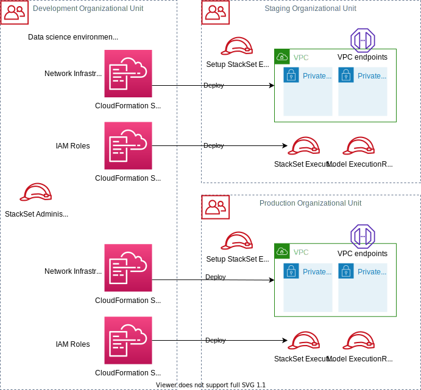
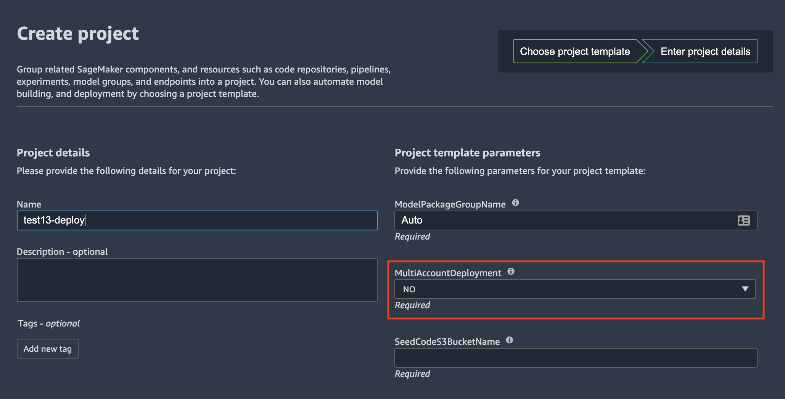
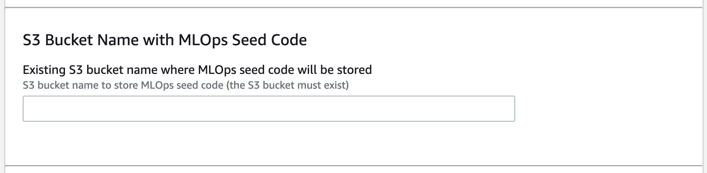
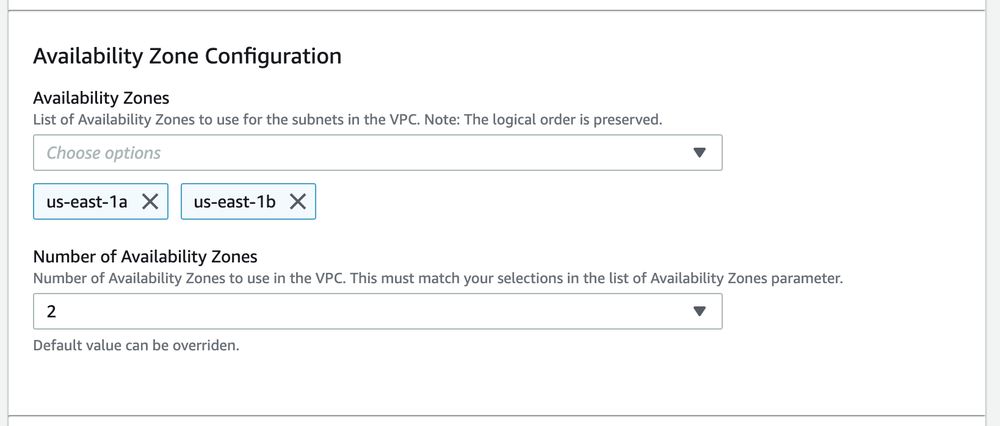
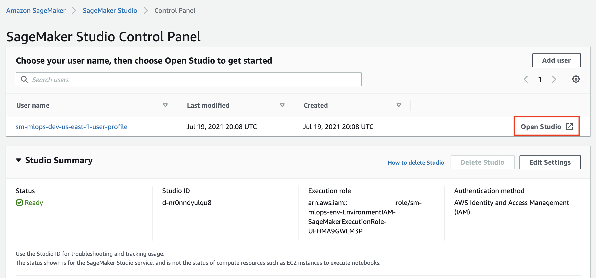
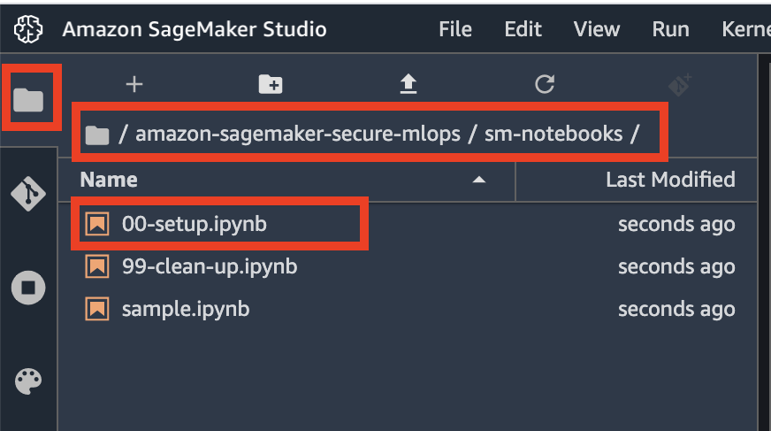

# Deployment guide
---

## Prerequisites
To deploy the solution, you must have **Administrator** (or **Power User**) permissions to package the CloudFormation templates, upload templates in your Amazon S3 bucket, and run the deployment commands.

You must also have [AWS CLI](https://aws.amazon.com/cli/). If you do not have it, see [Installing, updating, and uninstalling the AWS CLI](https://docs.aws.amazon.com/cli/latest/userguide/cli-chap-install.html). If you would like to use the multi-account model deployment option, you need access to minimum two AWS accounts, recommended three accounts for development, staging and production environments.

## Package CloudFormation templates
Please go through these [step-by-step instructions](../package-cfn.md) to package and upload the solution templates into a S3 bucket for the deployment.

### Optional - run security scan on the CloudFormation templates
If you would like to run a security scan on the CloudFormation templates using [`cfn_nag`](https://github.com/stelligent/cfn_nag) (recommended), you have to install `cfn_nag`:
```sh
brew install ruby brew-gem
brew gem install cfn-nag
```

To initiate the security scan, run the following command:
```sh
make cfn_nag_scan
```

## Deployment options
You have a choice of different independent deployment options using the delivered CloudFormation templates:
+ [**Data science environment quickstart**](#data-science-environment-quickstart): deploy an end-to-end data science environment with the majority of options set to default values. This deployment type supports **single-account model deployment workflow** only. _You can change only a few deployment options_
+ [**Two-step deployment via CloudFormation**](#two-step-deployment-via-cloudformation): deploy the core infrastructure in the first step and then deploy a data science environment, both as CloudFormation templates. CLI `aws cloudformation create-stack` is used for deployment. _You can change any deployment option_
+ [**Two-step deployment via CloudFormation and AWS Service Catalog**](#two-step-deployment-via-cloudformation-and-aws-service-catalog): deploy the core infrastructure in the first step via `aws cloudformation create-stack` and then provision a data science environment via [AWS Service Catalog](https://aws.amazon.com/servicecatalog/). _You can change any deployment option_

The following sections give step-by-step deployment instructions for each of the options.<br/>
You can also find all CLI commands in the delivered shell scripts in the project folder `test`.

### Special deployment options
This special type of deployment is designed for an environment, where all `iam:` API calls, such as role and policy creation, are separated from the main deployment. All IAM roles for users and services and related IAM permission policies should be created as part of a separate process following the **separation of duties** principle.

The IAM part can be deployed using the delivered CloudFormation templates or completely separated out-of-stack in your own process.

You provide the ARNs for the IAM roles as CloudFormation template parameters to deploy the data science environment.

If you use this deployment option, at no point you need any of `iam:*` permissions in your IAM permission policy to deploy a data science environment.

See [Appendix B](appendix.md#appendix-b)

## Multi-account model deployment prerequisites
❗ Skip this section if you don't use multi-account setup and jump to [Deployment types](#deployment-types).

### Concepts
In the following instructions we use the these concepts:
- **Main account**: AWS account where you deploy the data science environment with SageMaker domain and studio
- **Target accounts**: Staging and production AWS accounts used for model deployment

### Infrastructure
Multi-account model deployment requires VPC infrastructure and specific execution roles in the target accounts. The provisioning of the infrastructure and the roles is done automatically during the deployment of the data science environment as a part of the overall deployment process. **To enable multi-account setup you must provide the staging and production organizational unit (OUs) IDs OR staging and production account lists as CloudFormation parameters for the deployment.**

This diagram shows how CloudFormation stack sets are used to deploy the needed infrastructure to the target accounts.



Two stack sets - one for the VPC infrastructure and another for the roles - are deployed for each environment type, staging and production. <br/>
**One-off** setup is needed to enable **multi-account** model deployment workflow with SageMaker MLOps projects. 
❗ You **don't need** to perform this setup if you are going to use single-account deployment only.

### Step 1
The provisioning of a data science environment uses CloudFormation stack set to deploy the required IAM roles and VPC infrastructure into the target accounts.
The solution uses `SELF_MANAGED` stack set permission model and needs to bootstrap two IAM roles:
- `AdministratorRole` in the development account (main account)
- `SetupStackSetExecutionRole` in each of the target accounts

You must provision these roles **before** starting the solution deployment. The `AdministratorRole` is automatically created during the solution deployment. For the `SetupStackSetExecutionRole` you can use the delivered CloudFormation template [`env-iam-setup-stacksest-role.yaml`](../cfn_templates/env-iam-setup-stackset-role.yaml) or your own process of provisioning of an IAM role.

```bash
# STEP 1:
# SELF_MANAGED stack set permission model:
# Deploy a stack set execution role to _EACH_ of the target accounts in both staging and prod OUs
# This stack set execution role is used to deploy the target accounts stack sets in env-main.yaml
# ENV_NAME needs to be unique to be able to create s3 buckets for the environment and consistent with service catalog
# !!!!!!!!!!!! RUN THIS COMMAND IN EACH OF THE TARGET ACCOUNTS !!!!!!!!!!!!
ENV_NAME="sm-mlops" # Or use your own unique environment names like "sm-mlops-$DEPARTMENT_NAME"
ENV_TYPE=# use your own consistent environment stage names like "staging" and "prod"
ADMIN_ACCOUNT_ID=<DATA SCIENCE DEVELOPMENT ACCOUNT ID>

# Change or leave on default
SETUP_STACKSET_ROLE_NAME=$ENV_NAME-setup-stackset-execution-role
STACK_NAME=$ENV_NAME-setup-stackset-role

# Delete stack if it exists
aws cloudformation delete-stack --stack-name $STACK_NAME

aws cloudformation deploy \
                --template-file cfn_templates/env-iam-setup-stackset-role.yaml \
                --stack-name $STACK_NAME \
                --capabilities CAPABILITY_NAMED_IAM \
                --parameter-overrides \
                EnvName=$ENV_NAME \
                EnvType=$ENV_TYPE \
                StackSetExecutionRoleName=$SETUP_STACKSET_ROLE_NAME \
                AdministratorAccountId=$ADMIN_ACCOUNT_ID

aws cloudformation describe-stacks \
    --stack-name $STACK_NAME \
    --output table \
    --query "Stacks[0].Outputs[*].[OutputKey, OutputValue]"
```

Take a note of `StackSetExecutionRoleName` in the stack output. This name of the provisioned IAM role must be passed to the `env-main.yaml` template or used in Service Catalog-based deployment as `SetupStackSetExecutionRoleName` parameter.

### Step 2
**This step is only needed if you use AWS Organizations setup.**<br/>
A delegated administrator account must be registered in order to enable `ListAccountsForParent` AWS Organization API call. If the data science account is already the management account in the AWS Organizations, this step must be skipped.

```bash
# STEP 2:
# Register a delegated administrator to enable AWS Organizations API permission for non-management account
# Must be run under administrator in the AWS Organizations _management account_
aws organizations register-delegated-administrator \
    --service-principal=member.org.stacksets.cloudformation.amazonaws.com \
    --account-id=$ADMIN_ACCOUNT_ID

aws organizations list-delegated-administrators  \
    --service-principal=member.org.stacksets.cloudformation.amazonaws.com
```

## Multi-region deployment considerations
The solution is designed for multi-region deployment. You can deploy end-to-end stack in any region of the same AWS account. The following limitations and considerations apply:

+ The **shared IAM roles** (`DSAdministratorRole`, `SageMakerDetectiveControlExecutionRole`, `SCLaunchRole`) are created each time you deploy a new core infrastructure (`core-main`) or "quickstart" (`data-science-environment-quickstart`) stack. They created with `<StackName>-<RegionName>` prefix and designed to be unique within your end-to-end data science environment. For example, if you deploy one stack set (including core infrastructure and team data science environment) in one region and another stack in another region, these two stacks do not share any IAM roles and any users assuming any persona roles have an independent set of permissions per stack set and per region.
+ The **environment IAM roles** (`DSTeamAdministratorRole`, `DataScientistRole`, `SageMakerExecutionRole`, `SageMakerPipelineExecutionRole`, `SCProjectLaunchRole`, `SageMakerModelExecutionRole`) are created with unique names. Each deployment of a new data science environment (via CloudFormation or via AWS Service Catalog) creates a set of unique roles.
+ SageMaker Studio uses two pre-defined roles `AmazonSageMakerServiceCatalogProductsLaunchRole` and `AmazonSageMakerServiceCatalogProductsUseRole`. These roles are global for the AWS account and created by the first deployment of core infrastructure. These two roles have `Retain` deletion policy and _are not deleted_ when you delete the stack which has created these roles. These roles are **global** for the AWS account.

## Deployment types
The following three sections describes each deployment type and deployment use case in detail.

### Data science environment quickstart
This option deploys the end-to-end infrastructure and a data science Environment in one go.
You can change only few deployment options. The majority of the options are set to their default values.

**This is the recommended options for majority of deployments. Use other options only if you need to test or model a specific use case, for example multi-account model deployment.**
  
📜 Use this option if you want to provision a _completely new set_ of the infrastructure and do not want to parametrize the deployment.

❗ With Quickstart deployment type you can uses single-account model deployment only. Do not select `YES` for `MultiAccountDeployment` parameter for model deploy SageMaker project template:



The only deployment options you can change are:
+ `CreateSharedServices`: default `NO`. Set to `YES` if you want to provision a shared services VPC with a private PyPI mirror (_not implemented at this stage_)
+ `VPCIDR`: default `10.0.0.0/16`. CIDR block for the new VPC
+ Private and public subnets CIDR blocks: default `10.0.0.0/19`

Make sure you specify the CIDR blocks which do not conflict with your existing network IP ranges.

❗ You cannot use existing VPC or existing IAM roles to deploy this stack. The stack provisions a new own set of network and IAM resources.

Initiate the stack deployment with the following command. Use the S3 bucket name you used to upload CloudFormation templates in **Package CloudFormation templates** section.

```bash
STACK_NAME="ds-quickstart"
ENV_NAME="sm-mlops"

aws cloudformation create-stack \
    --template-url https://s3.$AWS_DEFAULT_REGION.amazonaws.com/$S3_BUCKET_NAME/sagemaker-mlops/data-science-environment-quickstart.yaml \
    --region $AWS_DEFAULT_REGION \
    --stack-name $STACK_NAME \
    --disable-rollback \
    --capabilities CAPABILITY_NAMED_IAM \
    --parameters \
        ParameterKey=EnvName,ParameterValue=$ENV_NAME \
        ParameterKey=EnvType,ParameterValue=dev \
        ParameterKey=SeedCodeS3BucketName,ParameterValue=$S3_BUCKET_NAME
```

The full end-to-end deployment takes about 25 minutes.

### Data science quickstart clean up
Refer to [data science environment clean up](clean-up.md#delete-data-science-environment-quickstart) section.

### Two-step deployment via CloudFormation
With this option you provision a data science environment in two steps, each with its own CloudFormation template. You can control all deployment parameters.  

📜 Use this option if you want to parametrize every aspect of the deployment based on your specific requirements and environment.

❗ You can select your existing VPC and network resources (subnets, NAT gateways, route tables) and existing IAM resources to be used for stack set deployment. Set the corresponding CloudFormation parameters to names and ARNs or your existing resources.

❗ You must specify the valid OU IDs for the `OrganizationalUnitStagingId`/`OrganizationalUnitProdId` **or** `StagingAccountList`/`ProductionAccountList` parameters for the `env-main.yaml` template to enable multi-account model deployment.

You can use the provided [shell script](../test/cfn-test-e2e.sh) to run this deployment type or follow the commands below.

#### Step 1: Deploy the core infrastructure
❗ Make sure you package the CloudFormation templates as described in [these instructions]((../package-cfn.md)).

In this step you deploy the _shared core infrastructure_ into your AWS Account. The stack (`core-main.yaml`) provisions:
1. Shared IAM roles for data science personas and services (optional if you bring your own IAM roles)
2. A shared services VPC and related networking resources (optional if you bring your own network configuration)
3. An AWS Service Catalog portfolio to provide a self-service deployment for the **data science administrator** user role
4. An ECS Fargate cluster to run a private PyPi mirror (_not implemented at this stage_)
5. Security guardrails for your data science environment (_detective controls are not implemented at this stage_)

The deployment options you can use are:
+ `CreateIAMRoles`: default `YES`. Set to `NO` if you have created the IAM roles outside of the stack (e.g. via a separate process) - such as "Bring Your Own IAM Role (BYOR IAM)" use case
+ `CreateSharedServices`: default `NO`. Set to `YES` if you would like to create a shared services VPC and an ECS Fargate cluster for a private PyPi mirror (_not implemented at this stage_)
+ `CreateSCPortfolio`: default `YES`. Set to `NO`if you don't want to to deploy an AWS Service Catalog portfolio with data science environment products
+ `DSAdministratorRoleArn`: **required** if `CreateIAMRoles=NO`, otherwise automatically provisioned
+ `SCLaunchRoleArn`: **required** if `CreateIAMRoles=NO`, otherwise automatically provisioned
+ `SecurityControlExecutionRoleArn`: **required** if `CreateIAMRoles=NO`, otherwise automatically provisioned

The following command uses the default values for the deployment options. You can specify parameters via `ParameterKey=<ParameterKey>,ParameterValue=<Value>` pairs in the `aws cloudformation create-stack` call:
```sh
STACK_NAME="sm-mlops-core"

aws cloudformation create-stack \
    --template-url https://s3.$AWS_DEFAULT_REGION.amazonaws.com/$S3_BUCKET_NAME/sagemaker-mlops/core-main.yaml \
    --region $AWS_DEFAULT_REGION \
    --stack-name $STACK_NAME  \
    --disable-rollback \
    --capabilities CAPABILITY_IAM CAPABILITY_NAMED_IAM \
    --parameters \
        ParameterKey=StackSetName,ParameterValue=$STACK_NAME
```

After a successful stack deployment, you can see the stack output:
```sh
aws cloudformation describe-stacks \
    --stack-name sm-mlops-core  \
    --output table \
    --query "Stacks[0].Outputs[*].[OutputKey, OutputValue]"
```

#### Step 2: Deploy a data science environment
The step 2 CloudFormation template (`env-main.yaml`) provides two deployment options:
+ **Deploy Studio into a new VPC**: This option provisions a new AWS network infrastructure consisting of:
   - VPC
   - private subnet in each Availability Zone (AZ)
   - optional public subnet in each AZ. The public subnets are provisioned only if you chose to create NAT gateways
   - VPC endpoints to access public AWS services and Amazon S3 buckets for data science projects
   - security groups
   - optional NAT gateway in each AZ  
   - if you select the NAT gateway option, the template creates an internet gateway and attaches it to the VPC
   - routing tables and routes for private and public subnets

You specify up to four AZs and CIDR blocks for VPC and each of the subnets.  
After provisioning the network infrastructure, the solution deploys Studio into this VPC.  

+ **Deploy Studio into an existing VPC**: This option provisions Studio in your existing AWS network infrastructure. You have several options to choose between existing or create new network resources:
  - VPC: you must provide a valid existing VPC Id
  - Subnets: you can choose between:
    - providing existing subnet CIDR blocks (set `CreatePrivateSubnets` to `NO`) - in this case no new subnets are provisioned and NAT gateway option **is not available**. All SageMaker resources are deployed into your existing VPC and private subnets. You use your existing NAT (if available) to access internet from the private subnets
    - provisioning new private (set `CreatePrivateSubnets` to `YES`) and optional (only if the NAT gateway option is selected, `CreateNATGateways` = `YES`) public subnets. The deployment creates new subnets with specified CIDR blocks inside your existing VPC.

You must specify up to four AZs you would like to deploy the network resources into.  

❗ The CloudFormation template creates a new internet gateway attaches it to the VPC in "existing VPC" scenario if you select the NAT gateway option by setting `CreateNATGateways` to `YES`. The stack creation fails if there is an internet gateway _already attached_ to the existing VPC and you select the NAT gateway option.

Example of the existing VPC infrastructure:


The data science environment deployment provisions the following resources in your AWS account:
+ environment-specific IAM roles (optional, if `CreateEnvironmentIAMRoles` set to `YES`)
+ a VPC with all network infrastructure for the environment (optional) - see the considerations above
+ VPC endpoints to access the environment's Amazon S3 buckets and AWS public services via private network
+ AWS KMS keys for data encryption 
+ two S3 buckets for environment data and model artifacts
+ AWS Service Catalog portfolio with environment-specific products
+ Studio domain and default user profile

If you choose the multi-account model deployment option by providing values for `OrganizationalUnitStagingId`/`OrganizationalUnitProdId` **or** `StagingAccountList`/`ProductionAccountList`, the deployment provisions the following resources in the target accounts:
+ VPC with a private subnet in each of the AZs, **no internet connectivity**
+ Security groups for SageMaker model hosting and VPC endpoints
+ Execution roles for stack set operations and SageMaker models

You can change any deployment options via CloudFormation parameters for [`core-main.yaml`](../cfn_templates/core-main.yaml) and [`env-main.yaml`](../cfn_templates/env-main.yaml) templates.

#### Single-account setup
Run command providing the deployment options for your environment. The following command uses the minimal set of the options:
```sh
# Use default or provide your own names
STACK_NAME="sm-mlops-env"
ENV_NAME="sm-mlops"

aws cloudformation create-stack \
    --template-url https://s3.$AWS_DEFAULT_REGION.amazonaws.com/$S3_BUCKET_NAME/sagemaker-mlops/env-main.yaml \
    --region $AWS_DEFAULT_REGION \
    --stack-name $STACK_NAME \
    --disable-rollback \
    --capabilities CAPABILITY_NAMED_IAM \
    --parameters \
        ParameterKey=EnvName,ParameterValue=$ENV_NAME \
        ParameterKey=EnvType,ParameterValue=dev \
        ParameterKey=AvailabilityZones,ParameterValue=${AWS_DEFAULT_REGION}a\\,${AWS_DEFAULT_REGION}b \
        ParameterKey=NumberOfAZs,ParameterValue=2 \
        ParameterKey=SeedCodeS3BucketName,ParameterValue=$S3_BUCKET_NAME
```

#### Multi-account setup
If you would like to use **multi-account model deployment**, you must provide the valid values for OU IDs **or** account lists and the name for the `SetupStackSetExecutionRole` from [`env-iam-setup-stacksest-role.yaml`](../cfn_templates/env-iam-setup-stackset-role.yaml) stack output:
```sh 
STACK_NAME="sm-mlops-env"
ENV_NAME="sm-mlops" # must be the same environment name you used for multi-account bootstrapping for the stack set execution role
# Provide OU IDs _or_ account ids
STAGING_OU_ID=<OU id>
PROD_OU_ID=<OU id>

STAGING_ACCOUNTS=<comma-delimited account list>
PROD_ACCOUNTS=<comma-delimited account list>

# provide the actual name of the role if you don't use the default name
SETUP_STACKSET_ROLE_NAME=$ENV_NAME-setup-stackset-execution-role

aws cloudformation create-stack \
    --template-url https://s3.$AWS_DEFAULT_REGION.amazonaws.com/$S3_BUCKET_NAME/sagemaker-mlops/env-main.yaml \
    --region $AWS_DEFAULT_REGION \
    --stack-name $STACK_NAME \
    --disable-rollback \
    --capabilities CAPABILITY_NAMED_IAM \
    --parameters \
        ParameterKey=EnvName,ParameterValue=$ENV_NAME \
        ParameterKey=EnvType,ParameterValue=dev \
        ParameterKey=AvailabilityZones,ParameterValue=${AWS_DEFAULT_REGION}a\\,${AWS_DEFAULT_REGION}b \
        ParameterKey=NumberOfAZs,ParameterValue=2 \
        ParameterKey=StartKernelGatewayApps,ParameterValue=NO \
        ParameterKey=SeedCodeS3BucketName,ParameterValue=$S3_BUCKET_NAME \
        ParameterKey=OrganizationalUnitStagingId,ParameterValue=$STAGING_OU_ID \
        ParameterKey=OrganizationalUnitProdId,ParameterValue=$PROD_OU_ID \
        ParameterKey=StagingAccountList,ParameterValue=$STAGING_ACCOUNTS \
        ParameterKey=ProductionAccountList,ParameterValue=$PROD_ACCOUNTS \
        ParameterKey=SetupStackSetExecutionRoleName,ParameterValue=$SETUP_STACKSET_ROLE_NAME
```

### CloudFormation clean up
Refer to [two step deployment via CloudFormation clean up](clean-up.md#delete-two-step-deployment-via-cloudformation) section.

### Two-step deployment via CloudFormation and AWS Service Catalog
This deployment option first deploys the core infrastructure including the AWS Service Catalog portfolio of data science products. In the second step, the data science Administrator deploys a data science environment via the AWS Service Catalog.  

📜 Use this option if you want to model the end user experience in provisioning a data science environment via AWS Service Catalog

❗ You can select your existing VPC and network resources (subnets, NAT gateways, route tables) and existing IAM resources to be used for stack set deployment. Set the corresponding CloudFormation and AWS Service Catalog product parameters to names and ARNs or your existing resources.

#### Step 1: Deploy the base infrastructure
Same as Step 1 from **Two-step deployment via CloudFormation**

#### Step 2: Deploy a data science environment via AWS Service Catalog
After the base infrastructure is provisioned, data scientists and other users must assume the DS Administrator IAM role (`AssumeDSAdministratorRole`) via link in the CloudFormation output. In this role, the users can browse the AWS Service Catalog and then provision a secure Studio environment.

First, print the output from the stack deployment in Step 1:
```bash
aws cloudformation describe-stacks \
    --stack-name sm-mlops-core  \
    --output table \
    --query "Stacks[0].Outputs[*].[OutputKey, OutputValue]"
```

Copy and paste the `AssumeDSAdministratorRole` link to a web browser and switch role to DS Administrator.


Go to AWS Service Catalog in the AWS console and select [**Products**](https://console.aws.amazon.com/servicecatalog/home?region=us-east-1#products) on the left pane:


You see the list of available products for your user role:


Click on the product name and and then on the **Launch product** on the product page:


Fill the product parameters with values specific for your environment. Provide the valid values for OU ids **OR** for the staging and production account lists and the name for the `SetupStackSetExecutionRole` if you would like to enable multi-account model deployment, otherwise keep these parameters empty.

There are only two **required** parameters you must provide in the product launch console:  
- S3 bucket name with MLOps seed code - use the S3 bucket where you packaged the CloudFormation templates, see the `S3_BUCKET_NAME` shell variable:

- Availability Zones: you need at least two AZs for SageMaker model deployment workflow:


Wait until AWS Service Catalog finishes the provisioning of the data science environment stack and the product status becomes **Available**. The data science environment provisioning takes about 20 minutes to complete.


Now you provisioned the data science environment and can start working with it.

### Service Catalog clean up
Refer to [two step deployment via CloudFormation and AWS Service Catalog clean up](clean-up.md#delete-two-step-deployment-via-cloudformation-and-aws-service-catalog) section.

## Post-deployment activities
After you successfully deploy all CloudFormation stacks and created the needed infrastructure, you can start Studio and start working with the delivered notebooks.

### Start Studio
To launch Studio you must go to [SageMaker console](https://console.aws.amazon.com/sagemaker/home?#/dashboard), click **Control panel** and click on the **Studio** in **Launch app** button on the **Users** panel:



### Clone code repository
To use the provided notebooks you must clone the source code repository into your Studio environment.
Open a system terminal in Studio in the **Launcher** window:


Run the following command in the terminal:
```sh
git clone https://github.com/aws-samples/amazon-sagemaker-secure-mlops.git
```

This command downloads and saves the code repository in your home directory in Studio.
Now go to the file browser and open [`00-setup` notebook](../sm-notebooks/00-setup.ipynb):



The first start of the notebook kernel on a new KernelGateway app takes about 5 minutes. Continue with the setup instructions in the notebook after Kernel is ready.

❗ You have to run the whole notebook to setup your SageMaker environment.

Now you setup your data science environment and can start experimenting.

---

[Back to README](../README.md)

---

Copyright Amazon.com, Inc. or its affiliates. All Rights Reserved.
SPDX-License-Identifier: MIT-0