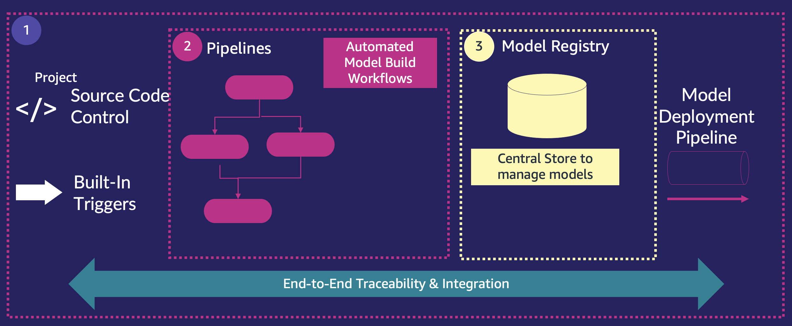
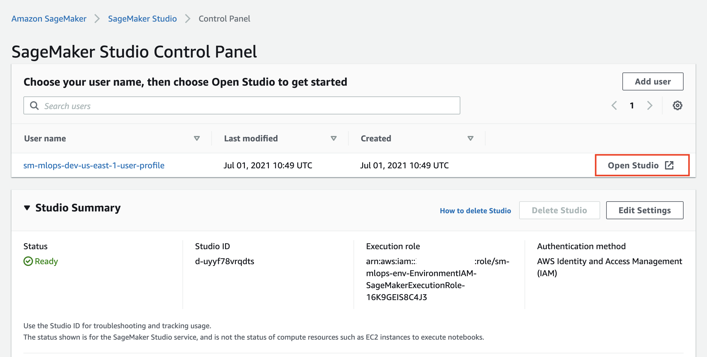
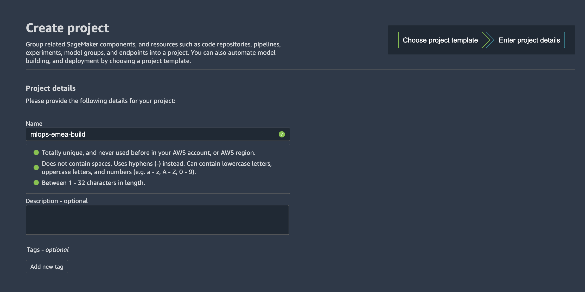
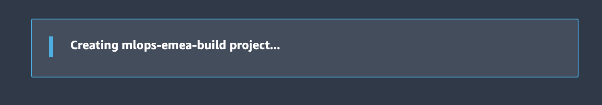
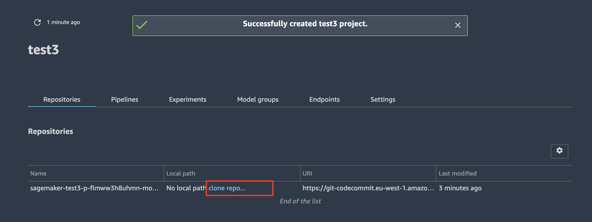
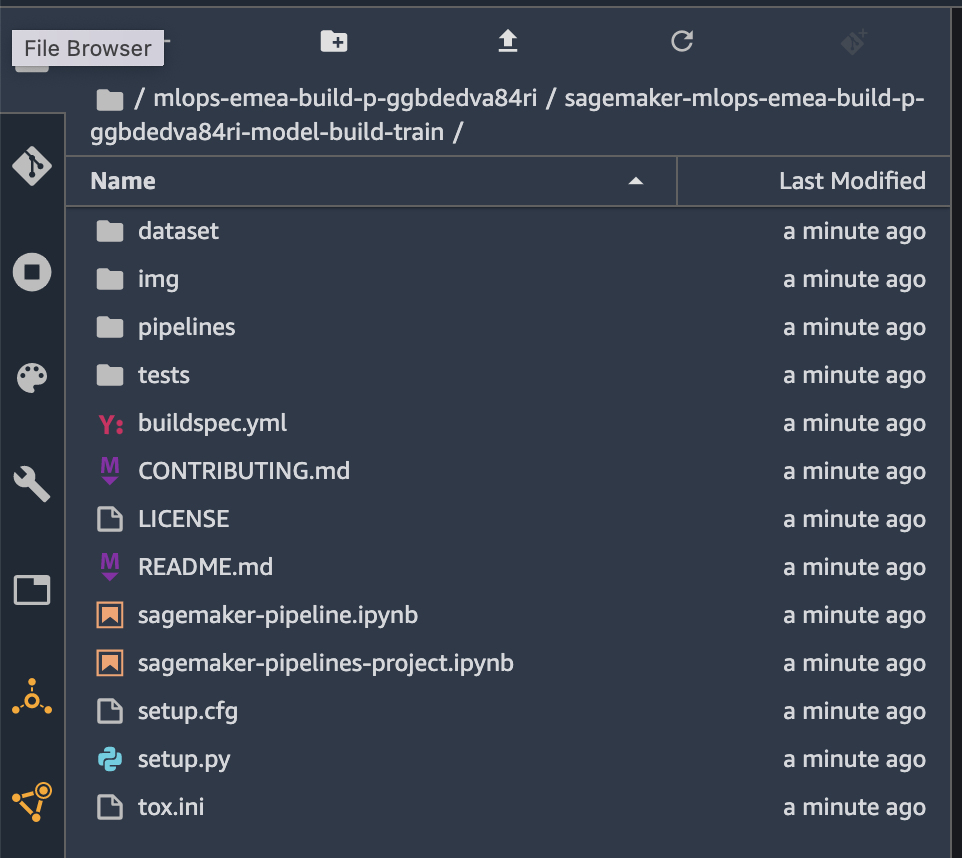
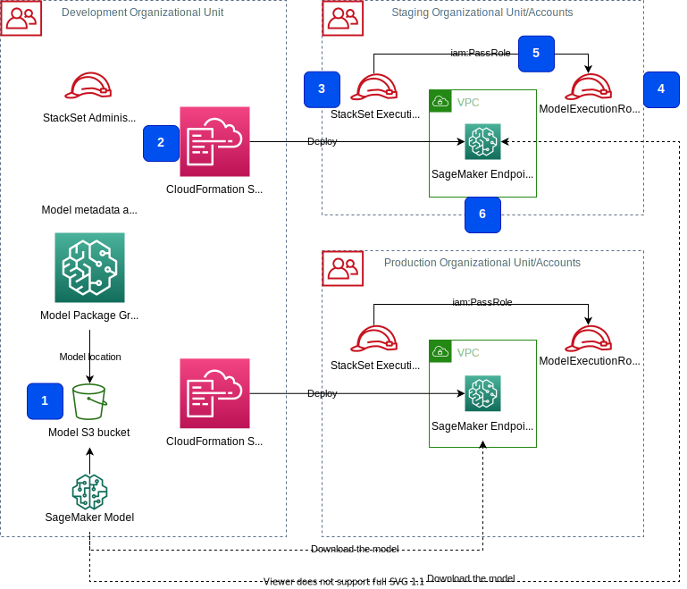
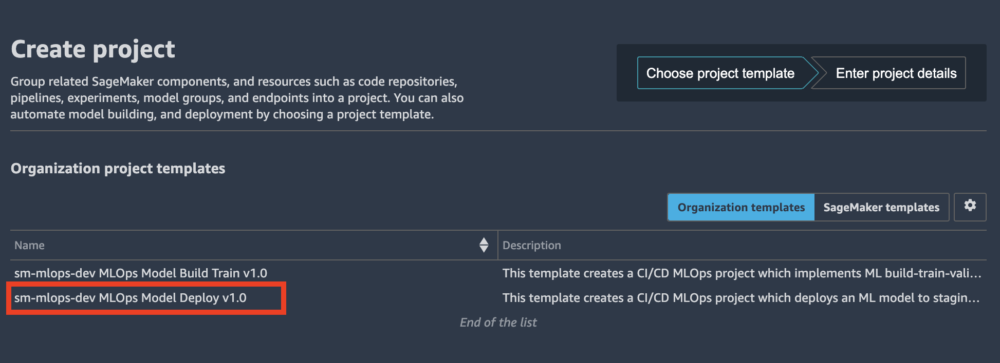

# MLOps
---

Amazon SageMaker helps you automate and standardize MLOps practices across your organization and provides the following components:



The goals of implementing MLOps for your ML projects and environment are:
+ Getting ML models to production
+ Operationalization of AI/ML workloads and workflows
+ Create secured, automated, and reproducible ML workflows
+ Manage models with a model registry and data lineage
+ Enable continuous delivery with IaC and CI/CD pipelines
+ Monitor performance and feedback information to your models
+ Providing compliance, security, and cost tools for ML development
+ Increasing collaboration and experimentation


## SageMaker projects
[Amazon SageMaker Projects](https://docs.aws.amazon.com/sagemaker/latest/dg/sagemaker-projects-whatis.html) brings CI/CD practices to ML, such as maintaining parity between development and production environments, source and version control, automated testing, and end-to-end automation. These help you standardize ML deployment processes and accelerate model deployment from days to minutes. 

## SageMaker pipelines
[Amazon SageMaker Pipelines](https://aws.amazon.com/sagemaker/pipelines/) is a fully managed feature that helps you automate and orchestrate different steps of the ML workflow, including data loading, data transformation, bias detection, model building, training, and evaluation. Process massive amounts of training data and build and retrain models at any scale. Share and reuse workflows to recreate or optimize models to scale ML across your organization.  

[Amazon SageMaker documentation](https://docs.aws.amazon.com/sagemaker/latest/dg/pipelines.html)

## SageMaker model registry
One of the key components of MLOps pipeline in SageMaker is the [model registry](https://docs.aws.amazon.com/sagemaker/latest/dg/model-registry.html).


Many customers train hundreds of models for a given use case, each with multiple versions. Tracking these models and their versions and the associated metadata is critical for repeatability and discoverability to enable model reuse and meet compliance requirements. With the SageMaker Model Registry, you can track model versions, their metadata such as use case grouping, and model performance metrics baselines in a central repository where it is easy to choose the right model for deployment based on your business requirements. Model Registry automatically logs the approval workflows for audit and compliance.

The model registry provides the following features:
+ Centralized model storage and tracking service that stores lineage, versioning, and related metadata for ML models
+ Stores governance and audit data (e.g. who trained and published the model, which datasets were used)
+ Stores models metrics and when the model was deployed to production
+ Manages model version life cycle
+ Manages the approval status of a model
+ Rollback model versions

## SageMaker model monitor
[Amazon SageMaker Model Monitor](https://docs.aws.amazon.com/sagemaker/latest/dg/model-monitor.html), which detects model drift and concept drift in models deployed in production in real time, is now integrated with SageMaker Pipelines and SageMaker Model Registry, allowing you to automatically schedule model monitoring as part of CI/CD. This allows you to automate the task of maintaining the quality of model predictions in production

## SageMaker feature store
[Amazon SageMaker documentation](https://docs.aws.amazon.com/sagemaker/latest/dg/feature-store.html)

## SageMaker projects in this solution
Functional MLOps project architecture based on [SageMaker project templates](https://docs.aws.amazon.com/sagemaker/latest/dg/sagemaker-projects-templates.html) as described in [Building, automating, managing, and scaling ML workflows using Amazon SageMaker Pipelines](https://aws.amazon.com/blogs/machine-learning/building-automating-managing-and-scaling-ml-workflows-using-amazon-sagemaker-pipelines/) and [Multi-account model deployment with Amazon SageMaker Pipelines](https://aws.amazon.com/blogs/machine-learning/multi-account-model-deployment-with-amazon-sagemaker-pipelines/) blog posts on the [AWS Machine Learning Blog](https://aws.amazon.com/blogs/machine-learning/).  

The following diagram shows the MLOps architecture which is implemented by this solution and delivered via SageMaker project templates:


The main design principles are:
+ Project templates are deployed via Studio
+ Dedicated IAM user and execution roles used to perform assigned actions/tasks in the environment
+ All project artifacts are connected via SageMaker ProjectId ensuring a strong data governance and lineage
+ Multi-account deployment approach is used for secure deployment of your SageMaker models

## SageMaker custom project templates
This solution delivers two custom project templates:
- Model build, train, and validate pipeline
- Multi-account model deploy pipeline

These projects are fully functional examples which are integrated with existing multi-layer security controls such as VPC, subnets, security groups, AWS account boundaries, and the dedicated IAM execution roles. 

## How to provision a new project
Sign in to the console with the data scientist account. On the [SageMaker console](https://console.aws.amazon.com/sagemaker/home?region=us-east-1#/dashboard), open Studio with your user profile (default name is `<environment name>-<environment type>-<region>-user-profile`). 



In the Studio:
1. Choose the **SageMaker resources**
2. On the drop-down menu, choose **Projects**
3. Choose **Create project**
4. Choose **Organization templates**
5. Choose a project template from the list


## CodeCommit seed code
Each of the delivered projects contains a seed code which is deployed as project's CodeCommit repository.  

The seed repository contains fully functional source code used by the CI/CD pipeline for model building, training, and validating, or for multi-project model deployment. Refer to `README.md` for each of the provided projects.

To work with the seed repository source code you must clone the repository into your Studio environment.
If you would like to amend the seed code and update the project templates with new version of the code, refer to the [Appendix G](appendix.md#appendix-g).

## Custom project template to build, train, validate the model
The solution is based on the [SageMaker project template](https://docs.aws.amazon.com/sagemaker/latest/dg/sagemaker-projects-templates-sm.html) for model building, training, and deployment. You can find in-depth review of this project in [Building, automating, managing, and scaling ML workflows using Amazon SageMaker Pipelines](https://aws.amazon.com/blogs/machine-learning/building-automating-managing-and-scaling-ml-workflows-using-amazon-sagemaker-pipelines/) on the [AWS Machine Learning Blog](https://aws.amazon.com/blogs/machine-learning/).

The following diagram shows the functional components of the project.


This project provisions the following resources as part of a MLOps pipeline:
1. The template is made available through SageMaker projects and is provided via an AWS Service Catalog portfolio 
2. A CodePipeline pipeline with two stages - `Source` to get the source code and `Build` to build and execute the SageMaker pipeline
3. A SageMaker pipeline implements a repeatable workflow which processes the data, trains, validates, and register the model
4. Seed code repository in CodeCommit:
  - This repository provides seed code to create a multi-step model building pipeline including the following steps: data processing, model training, model evaluation, and conditional model registration based on model accuracy. As you can see in the `pipeline.py` file, this pipeline trains a linear regression model using the [XGBoost algorithm](https://docs.aws.amazon.com/sagemaker/latest/dg/xgboost.html) on the well-known [UCI Abalone dataset](https://archive.ics.uci.edu/ml/datasets/abalone). This repository also includes a [build specification file](https://docs.aws.amazon.com/codebuild/latest/userguide/build-spec-ref.html), used by CodePipeline and CodeBuild to run the pipeline automatically

### Work with Model build, train, and validate project
Select **MLOps Model Build Train** project template from **Organization templates** list as described in [How to provision a new project](#how-to-provision-a-new-project) section.

The only project parameter you need to provide is a project name:



Wait until **Creating project...** banner:

 

turns into **Successfully created project**:


To deploy the notebooks into your local environment, you must clone the CodeCommit repository with the seed code after you have provisioned a SageMaker project in Studio. Go to the project overview page, select the `Repositories` tab and click the `clone repo...` link:



After the clone operation finished, you can browse the repository files in Studio File view:



You find step-by-step instructions, implementation details, and usage patterns of the model building pipeline project in the seed code notebooks [`sagemaker-pipeline.ipynb`](../mlops-seed-code/model-build-train/sagemaker-pipeline.ipynb) and [`sagemaker-pipelines-project.ipynb`](../mlops-seed-code/model-build-train/sagemaker-pipelines-project.ipynb).

You can open a notebook and start experimenting with SageMaker Pipelines.

## Custom project template for multi-account model deployment
The following diagram shows the functional components of the project.


This project consists of the following parts:
1. The project template deployable through SageMaker project in Studio
2. CodeCommit repository with seed code 
3. Model deployment multi-stage CodePipeline pipeline
4. Staging AWS account (can be the same account as the data science account)
5. Production AWS account (can be the same account as the data science account)
6. SageMaker endpoints with an approved model [hosted in your private VPC](https://docs.aws.amazon.com/sagemaker/latest/dg/host-vpc.html)

The following diagram shows how the trained and approved model is deployed into the target accounts.



After model training and validation, the model is registered in the [model registry](https://docs.aws.amazon.com/sagemaker/latest/dg/model-registry.html). Model registry stores the model metadata, and all model artifacts are stored in an S3 bucket (step **1** in the preceding diagram). The CI/CD pipeline uses CloudFormation stack sets **(2)** to deploy the model in the target accounts. The CloudFormation service assume the role `StackSetExecutionRole` **(3)** in the target account to perform the deployment. SageMaker also assumes the `ModelExecutionRole` **(4)** to access the model metadata and download the model artifacts from the S3 bucket. The `StackSetExecutionRole` must have `iam:PassRole` permission **(5)** for `ModelExecutionRole` to be able to pass the role successfully. Finally, the model is deployed to a SageMaker endpoint **(6)**.

To access the model artifacts and a KMS encryption key an additional cross-account permission setup is needed in case of the multi-account deployment:


All access to the model artifacts happens via the S3 VPC endpoint **(1)**. This VPC endpoint allows access to the model and data S3 buckets. The model S3 bucket policy **(2)** grant access to the ModelExecutionRole principals **(5)** in each of the target accounts.

```json
"Sid": "AllowCrossAccount",
"Effect": "Allow",
"Principal": {
    "AWS": [
            "arn:aws:iam::<staging-account>:role/SageMakerModelExecutionRole",
            "arn:aws:iam::<prod-account>:role/SageMakerModelExecutionRole",
            "arn:aws:iam::<dev-account>:root"
        ]
}
```

We apply the same setup for the data encryption key **(3)**, whose policy **(4)** grant access to the principals in the target accounts. 
SageMaker model-hosting endpoints are placed in a VPC **(6)** in each of the target accounts. Any access to S3 buckets and KMS keys happens via the corresponding VPC endpoints. The IDs of these VPC endpoints are added to the Condition statement of the S3 bucket and KMS keys resource policies.

```json
"Sid": "DenyNoVPC",
"Effect": "Deny",
"Principal": "*",
"Action": [
    "s3:GetObject",
    "s3:PutObject",
    "s3:ListBucket",
    "s3:GetBucketAcl",
    "s3:GetObjectAcl",
    "s3:PutBucketAcl",
    "s3:PutObjectAcl"
    ],
    "Resource": [
        "arn:aws:s3:::sm-mlops-dev-us-east-1-<account_id>-models/*",
        "arn:aws:s3:::sm-mlops-dev-us-east-1-<account_id>-models"
    ],
    "Condition": {
         "StringNotEquals": {
              "aws:sourceVpce": [
                   "vpce-0b82e29a828790da2",
                   "vpce-07ef65869ca950e14",
                   "vpce-03d9ed0a1ba396ff5"
                    ]
         }
    }
```

### Multi-account model deployment prerequisites
Multi-account model deployment can use the AWS Organizations setup to deploy model to the staging and production organizational units (OUs) **or** provided staging and production account lists. For a proper functioning of the **multi-account** deployment process, you must configure the cross-account access and specific execution roles in the target accounts.

#### Execution roles
Execution roles `SageMakerModelExecutionRole` and `StackSetExecutionRole` must be deployed in all target accounts. Target accounts are accounts where models are deployed. These accounts are member of the staging and production OUs or provided in the staging and production account lists at data science environment provisioning time.
  
These execution roles are deployed to the target accounts automatically during the provisioning of the data science environment if the parameter `CreateEnvironmentIAMRoles` is set to `YES`. If this parameter is set to `NO`, you are responsible for provisioning of the execution roles in all target accounts. Refer to [`predeploy-iam-setup.md'](predeploy-iam-setup.md) for step-by-step instructions. 

The model execution role `SageMakerModelExecutionRole` in the staging and production accounts is assumed by `AmazonSageMakerServiceCatalogProductsUseRole` in the data science environment account to test the endpoints in the target accounts. 

_Alternatively_ you can choose to use single-account deployment. In this case the pipeline deploys an ML model into the data science account (Studio account). You do not need to setup target account execution roles and provide OU IDs or account lists as deployment parameters.

❗ If you use single-account deployment, the `MultiAccountDeployment` variable for Model Deploy project must be set to `NO`:


### Model deployment prerequisites
The following prerequisites are common for both single- and multi-account deployment. **These prerequisites are automatically provisioned if you use provided the CloudFormation templates.**

+ SageMaker must be configured with **at least two subnets in two AZs**, otherwise the SageMaker endpoint deployment fails as it requires at least two AZs to deploy an inference endpoint
+ CI/CD pipeline with model deployment uses [AWS CloudFormation StackSets](https://docs.aws.amazon.com/AWSCloudFormation/latest/UserGuide/stacksets-getting-started.html). It requires two IAM service roles created or provided (in case of the BYO IAM role option):
  - `StackSetAdministrationRole`: This role must exist in the **data science account** and used to perform administration stack set operations in the data science account. The `AmazonSageMakerServiceCatalogProductsUseRole` must have `iam:PassRole` permission for this role
  - `StackSetExecutionRole`: This role must exist in the data science account and **each of the target accounts** in staging and production environments. This role is assumed by `StackSetAdministrationRole` to perform stack set operations in the target accounts. This role must have `iam:PassRole` permission for the model execution role `SageMakerModelExecutionRole`

### Work with Model deployment project
Select **MLOps Model Deploy** project template from **Organization templates** list as described in [How to provision a new project](#how-to-provision-a-new-project) section:



To deploy the notebooks into your local environment, you must clone the CodeCommit repository with the seed code after you have provisioned a SageMaker project in Studio:


You find step-by-step instructions, implementation details, and usage patterns of multi-account model deployment in the provided [notebook](../mlops-seed-code/model-deploy/sagemaker-model-deploy.ipynb).

## Clean up after working with project templates
After you have finished working and experimenting with projects you should perform clean up of the provisioned SageMaker resources to avoid charges.
The following billable resources should be removed:
- CloudFormation stack sets with model deployment (in case you run Model deploy pipeline)  
  This deletes provisioned SageMaker endpoints and associated resources
- SageMaker projects and corresponding S3 buckets with project artifacts
- Any data in the data and model S3 buckets

❗ **This is a destructive action. All data on in Amazon S3 buckets for MLOps pipelines, ML data, and ML models in the project scope will be permanently deleted. All project seed code repositories in the project scope will be permanently removed from your AWS environment.**

### Clean up with Studio notebook
The provided notebooks for projects - [sagemaker-model-deploy](../mlops-seed-code/model-deploy/sagemaker-model-deploy.ipynb) and [sagemaker-pipelines-project](../mlops-seed-code/model-build-train/sagemaker-pipelines-project.ipynb) - include clean-up code to remove created resources such as SageMaker projects, SageMaker endpoints, CloudFormation stack sets, and S3 bucket. Run the code cells in the _Clean up_ section after you finished experimenting with the project:
```python
import time

cf = boto3.client("cloudformation")

for ss in [
        f"sagemaker-{project_name}-{project_id}-deploy-{env_data['EnvTypeStagingName']}",
        f"sagemaker-{project_name}-{project_id}-deploy-{env_data['EnvTypeProdName']}"
        ]:
    accounts = [a["Account"] for a in cf.list_stack_instances(StackSetName=ss)["Summaries"]]
    print(f"delete stack set instances for {ss} stack set for the accounts {accounts}")
    r = cf.delete_stack_instances(
        StackSetName=ss,
        Accounts=accounts,
        Regions=[boto3.session.Session().region_name],
        RetainStacks=False,
    )
    print(r)

    time.sleep(180)

    print(f"delete stack set {ss}")
    r = cf.delete_stack_set(
        StackSetName=ss
    )
```

```python
print(f"Deleting project {project_name}:{sm.delete_project(ProjectName=project_name)}")
```

In Studio system terminal run the following command:
```sh
!aws s3 rb s3://sm-mlops-cp-{project_name}-{project_id} --force
```

### CLI commands to perform clean up
Alternatively, you can run the commands in [shell script](../test/cfn-test-e2e.sh) to clean up resources of multiple projects.

After completion of all clean-up steps for projects you can proceed with [data science environment clean up steps](clean-up.md).

---

[Back to README](../README.md)

---

Copyright Amazon.com, Inc. or its affiliates. All Rights Reserved.
SPDX-License-Identifier: MIT-0