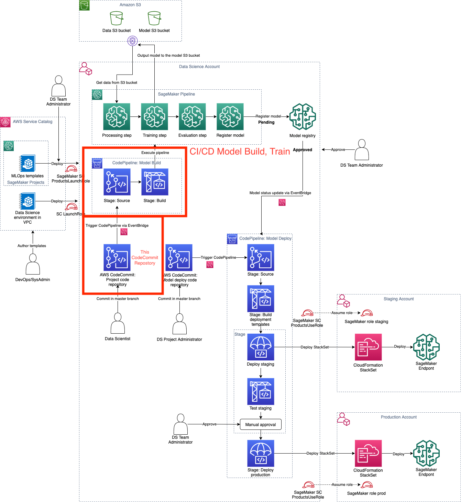

# Secure MLOps for SageMaker

The following diagram shows this CI/CD Model Build and Train pipeline in the context of the whole MLOps Data Science solution.

You own this seed code and you can modify this template to reflect your environment, MLOps guidelines, and project governance. You can also add additional tests for your custom validation to the TestStaging step.

A description of some of the artifacts is provided below.

## Organization of the SageMaker model deploy seed code