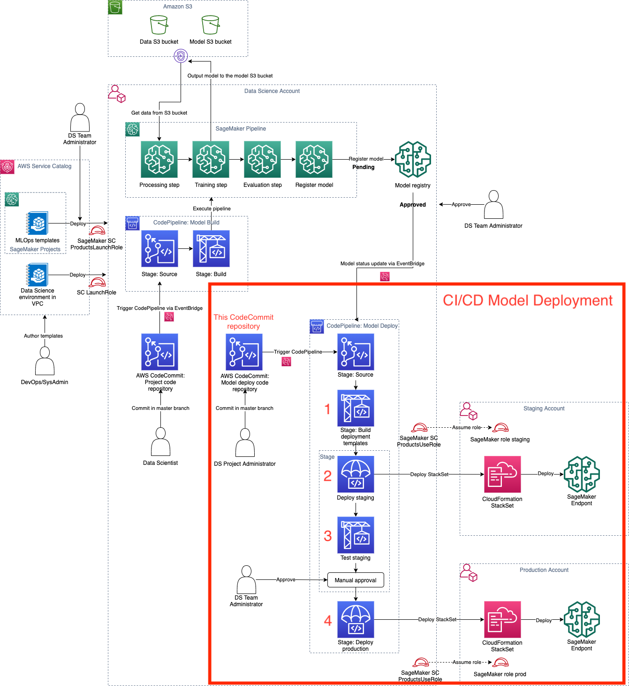

# Secure MLOps for SageMaker

This is a sample code repository for demonstrating how you can organize your code for deploying an realtime inference Endpoint infrastructure in multi-account environment. This code repository is created as part of creating a Project in SageMaker. 

This code repository has the code to find the latest approved ModelPackage for the associated ModelPackageGroup and automaticaly deploy it to the Endpoint on detecting a change (`build.py`). This code repository also defines the CloudFormation template which defines the Endpoints as infrastructure. It also has configuration files associated with `staging` and `production` stages. 

This CI/CD pipeline is triggered by each commit to this repository and by any state change (e.g. registering a new model) in the SageMaker Model Package.
Upon triggering a deployment:
1. the CodePipeline pipeline will build the artefacts (configuration and deployment CloudFormation template). 
2. After the build step, the CodePipeline will deploy the first endpoint - `staging` into the **staging account** defined by `OrganizationalUnitStagingId`. 
3. After staging deployment is completed, the CodePipeline runs the TestStaging step and waits for a **manual approval step** for promotion to the prod stage. You will need to go to CodePipeline AWS Managed Console to complete this step.
4. After manual approval the CodePipeline will deploy the second endpoint - `production` into the **production account** defined by `OrganizationalUnitProdId`.

The following diagram shows this CI/CD Model Deployment pipeline in the context of the whole MLOps Data Science solution.

You own this seed code and you can modify this template to reflect your environment, MLOps guidelines, and project governance. You can also add additional tests for your custom validation to the TestStaging step.

A description of some of the artifacts is provided below.

## Organization of the SageMaker model deploy seed code
`buildspec.yml`
 - this file is used by the CodePipeline's Build stage to package a CloudFormation template for `cfn-sm-endpoint-template.yml`.

`build.py`
 - this python file contains code to get the latest approve package arn and exports staging and configuration files.

`cfn-sm-endpoint-template.yml`
 - this CloudFormation file is packaged by the build step into a CloudFormation template file and is deployed to `staging` and `production` stages.

`staging-config-template.json`
 - this configuration files is used to customize staging stage in the pipeline.

`prod-config-template.json`
 - this configuration files is used to customize production stage in the pipeline.

`test\buildspec.yml`
  - this file is used by the CodePipeline's DeployStaging stage to run the test code of the following python file

`test\test.py`
  - this python file contains code to describe and invoke the staging endpoint.
  - **Add your custom endpoing test logic to this file**

## AWS Organizations setup for MLOps model deploy
You must have a proper AWS Orgainzations setup with the data science account and the two additional accounts for a proper functioning of this MLOps model deployment project.

Each account must be added to a different [organizational unit (OU)](https://docs.aws.amazon.com/organizations/latest/userguide/orgs_getting-started_concepts.html).

Your Organizations structure should look like the following:
+ Root
    - multi-account-deployment (OU)
        * `111111111111` (data science development account with SageMaker Studio)
        * staging (OU)
            * `222222222222` (data science staging AWS account)
        * production (OU)
            * `333333333333` (data science production AWS account)

Copyright Amazon.com, Inc. or its affiliates. All Rights Reserved.
SPDX-License-Identifier: MIT-0