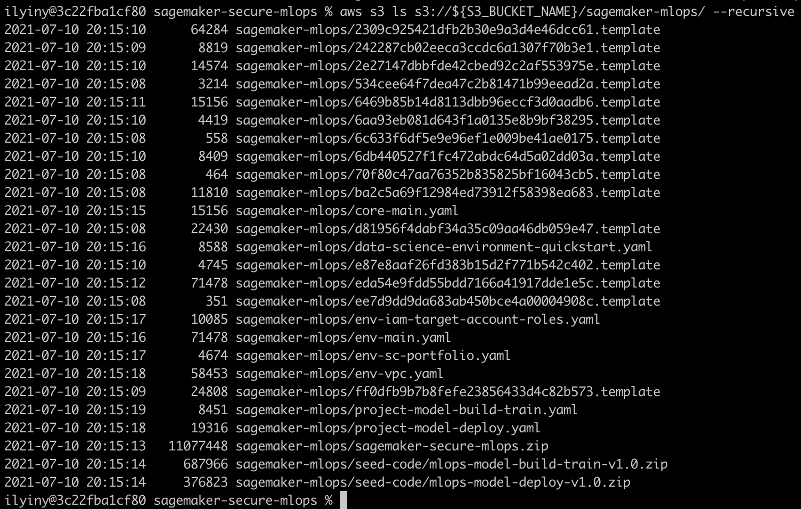

# Package CloudFormation templates
Before you can deploy the delivered [CloudFormation templates](cfn_templates), they need to be packaged and uploaded to an Amazon S3 bucket for deployment. There are two options how you can perform this preparation step.

## Option 1 - use a CloudFormation template to package and upload
This option first deploys a simple CloudFormation template [`package-cfn.yaml`](package-cfn.yaml). The template creates a [CodeBuild](https://aws.amazon.com/codebuild/) project which packages and uploads the deployment templates into the specified S3 bucket.

To follow along with the deployment instructions, run the following commands in your terminal (all commands were tested for macOS 10.15.7, but they will work on Windows as well).

1. Clone the GitHub repository:
```sh
git clone https://github.com/aws-samples/amazon-sagemaker-secure-mlops.git
cd amazon-sagemaker-secure-mlops
```

2. If you do not have an S3 bucket, you must create a brand new one. **Skip this step if you already have an S3 bucket**.
```sh
S3_BUCKET_NAME=<your new S3 bucket name>
aws s3 mb s3://${S3_BUCKET_NAME} --region $AWS_DEFAULT_REGION
```

3. Create a zip file with solution's source code:
```sh
rm -f sagemaker-secure-mlops.zip
zip -r sagemaker-secure-mlops.zip . -x "*.pdf" -x "*.git*" -x "*.DS_Store*" -x "*.vscode*" -x "/build/*" -x "internal-documents*"
```

4. Upload the zip file to the S3 bucket:
```sh
S3_BUCKET_NAME=<your existing or just created S3 bucket name>
aws s3 cp sagemaker-secure-mlops.zip s3://${S3_BUCKET_NAME}/sagemaker-mlops/
```

5. Deploy the CloudFormation template:
```sh
STACK_NAME=sagemaker-mlops-package-cfn
aws cloudformation deploy \
        --template-file package-cfn.yaml \
        --stack-name $STACK_NAME \
        --capabilities CAPABILITY_NAMED_IAM \
        --parameter-overrides \
        S3BucketName=$S3_BUCKET_NAME 
```

6. Wait until deployment has finished and print the stack outputs with the following command (you may wait couple of minutes before the templates appear in the S3 bucket):
```sh
aws cloudformation describe-stacks \
    --stack-name $STACK_NAME \
    --output table \
    --query "Stacks[0].Outputs[*].[OutputKey, OutputValue]"
```

📜 **Save the output to your scratch pad for later use.**

7. Check that the deployment templates are uploaded into the S3 bucket:
```sh
aws s3 ls s3://${S3_BUCKET_NAME}/sagemaker-mlops/ --recursive
```



Now all deployment CloudFormation templates are packaged and uploaded to your S3 bucket. You can proceed with [further deployment steps](README.md#deployment).

## Option 2 - use a shell script to package and upload
If you use macOS/Linux you can run the delivered packaging script via `make` command. This script **will not** work on Windows.

Run the following command to package and upload the deployment templates into your S3 bucket. You can specify either a name for an existing S3 bucket or a new name (an S3 bucket will be created for you). If you use the existing S3 bucket, it must be in **the same region** where you are deploying the CloudFormation templates.

```sh
S3_BUCKET_NAME=<your existing or new Amazon S3 bucket name>
make package CFN_BUCKET_NAME=$S3_BUCKET_NAME DEPLOYMENT_REGION=$AWS_DEFAULT_REGION
```

Run the `ls` on the S3 bucket to check that all templates are uploaded:
```sh
aws s3 ls s3://${S3_BUCKET_NAME}/sagemaker-mlops/ --recursive
```